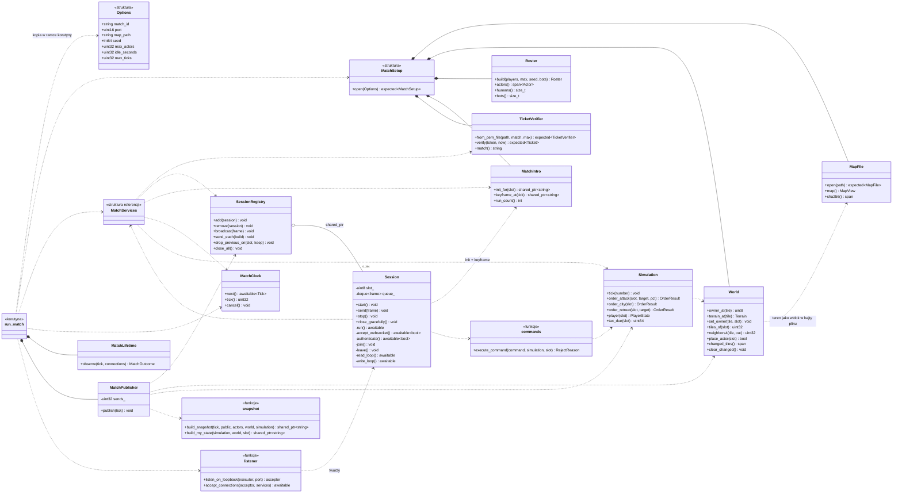
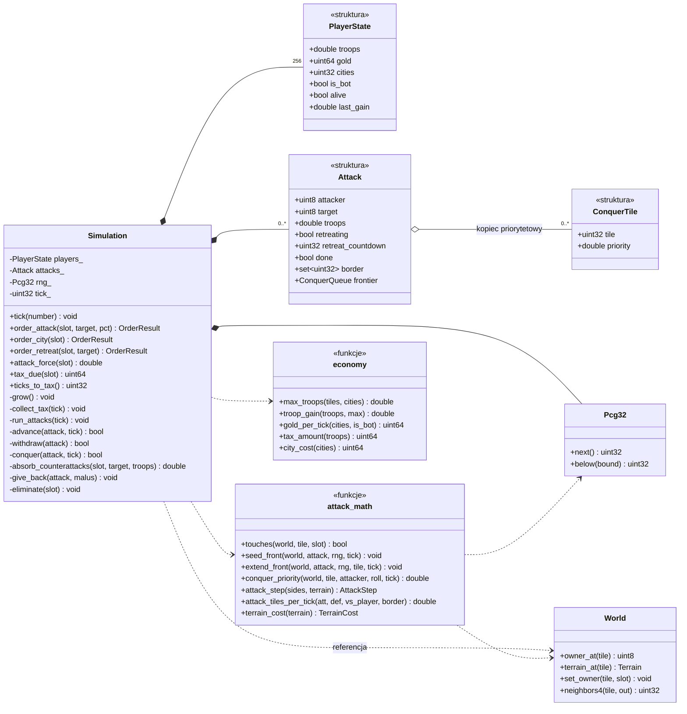

# Dokumentacja aplikacji

Opis **tego, co jest faktycznie zaimplementowane** w repozytorium — funkcjonalności, kontrakty,
konfiguracja, uruchomienie.

**Status:** v1 pre-alpha — **mecz jest grywalny od końca do końca**, brakuje decyzji botów
i odbioru wyniku
**Aktualność:** 04.08.2026

> **Relacja do drugiego dokumentu.** [architektura-gry-terytorialnej.md](architektura-gry-terytorialnej.md)
> opisuje **projekt docelowy** — symulację w C++, protobuf, delty kafelków, orkiestrację. Ten
> dokument opisuje **stan bieżący kodu**. Gdziekolwiek jest odwołanie w postaci „D11" albo „§5③",
> chodzi o decyzję albo sekcję z tamtego dokumentu.

---

## 1. Czym aplikacja jest dzisiaj

**Grą, w którą da się zagrać od wejścia na stronę do końca meczu.** Gracz dostaje tożsamość bez
rejestracji, ustawia nick i kolor, dołącza do lobby i widzi na żywo, kto jeszcze czeka. Gdy licznik
dobija do zera, lobby zamraża roster, **stawia proces serwera gry**, rozdaje bilety i otwiera
następne lobby. Przeglądarka otwiera wtedy mapę 2000×1000, gracz stoi na swoim terytorium
startowym i od tej chwili gra: wysyła ludzi na sąsiadów i na pustkowie, patrzy, jak front przesuwa
się kafelek po kafelku, zbiera złoto, stawia miasta i płaci podatek od tych, których zostawił
w domu.

Ścieżka jest zamknięta i przechodzi się ją bez ani jednej komendy w terminalu: meta stawia proces
meczu sama, podaje mu roster standardowym wejściem i czeka, aż zacznie nasłuchiwać, zanim rozda
bilety (§4.18). Proces gasi się też sam — po braku graczy albo po twardym limicie czasu (§4.17).
Odświeżenie strony w trakcie meczu wraca do tego samego meczu, a zerwane połączenie odbudowuje
się samo (§4.19).

**Czego nie ma:**

- **decyzji botów** — rosną, bronią się i giną, ale same nie atakują, więc mecz stu aktorów byłby
  meczem jednego gracza przeciwko dziewięćdziesięciu dziewięciu nieruchomym celom. Dlatego
  w środowisku deweloperskim są **wyłączone** (`Match:FillWithBots`) i gra się solo;
- **odbioru wyniku meczu** — meta wie, że proces zgasł, ale nie wie, kto wygrał (§4.21);
- **kont** — wyłącznie goście, tożsamość żyje w tokenie i w bazie.

Skąd się wziął ten stan, opisują dwa plany: [plan-serwera-gry.md](plan-serwera-gry.md) (etapy E1–E5)
i [plan-alokacji-meczu.md](plan-alokacji-meczu.md).

### 1.1 Mapa stanu implementacji

| Obszar | Stan |
|---|---|
| Tożsamość gościa, sesja, token | **gotowe** |
| Profil gracza (nick, kolor HSV) | **gotowe** |
| Lobby — roster, nagłówek, snapshoty na żywo | **gotowe** |
| Kanał realtime (SignalR) + zegar rozgłaszania | **gotowe** |
| Odliczanie + synchronizacja zegara klienta | **gotowe**, włączone |
| Karencja rozłączenia, obsługa wielu kart | **gotowe** |
| Cykl życia lobby (zbieranie → start → zamknięcie) | **gotowe** i osiągalne |
| Start meczu: sloty, zapis meczu, bilety, nowe lobby | **gotowe** (etapy 1–2 planu alokacji) |
| Trasa `/match/:matchId`, guard, ponowne wydanie biletu | **gotowe** |
| Persystencja gracza i meczu (EF Core + SQLite) | **gotowe** |
| Widoki `guide` i `contact` | **zaślepki** („in progres...") |
| Widok meczu: mapa, kamera (przeciąganie, zoom, WSAD, wyśrodkowanie) | **gotowe** (§4.19) |
| Rozkazy gracza: atak procentem puli, budowa miasta | **gotowe** (§4.19, §4.20) |
| HUD meczu: pula ludzi, złoto z paskiem podatku, ranking, podpisy terytoriów | **gotowe** (§4.19) |
| Wejście do meczu: WebSocket, weryfikacja biletu, snapshoty | **gotowe** po stronie serwera (§4.15) |
| Klient testowy meczu (Node, bez przeglądarki) | **gotowe** |
| Pipeline CI: budowa i testy na dwóch platformach, analiza statyczna, sanitizery | **gotowe** — cztery zadania (§6.4) |
| Katalog map | jedna pozycja wpisana na sztywno |
| Format pliku terenu `.tmap` i konwerter `tmapgen` | **gotowe** (§4.16) |
| Mapa w meczu: `MatchInit` + keyframe RLE po wejściu | **gotowe** (§4.15) |
| Alokacja procesu game-serwera | **gotowe w dev** — meta uruchamia proces i czeka na gotowość (§4.18); atrapa zostaje pod `Match:Allocator` |
| Proxy dev-servera (`wss://localhost:4200/ws/match`) | **gotowe** (§7.2) — klient nie widzi portu procesu |
| Serwowanie terenu klientowi (`/maps/...`) | **gotowe w dev** (§5.1); docelowo CDN |
| Podpis biletu | **gotowe** — JWT ES256 (ECDSA P-256), weryfikowany offline przez serwer gry |
| Serwer gry — szkielet (etapy E1–E2) | **gotowe**: proces, zegar 10 Hz, protobuf, WebSocket, bilety |
| Serwer gry — roster: sloty z manifestu, boty z ziarna | **gotowe** (§4.17) |
| Serwer gry — ranking `PublicState` co 1 Hz | **gotowe** |
| Serwer gry — gaszenie procesu (trzy warunki) | **gotowe** (§4.17) |
| Serwer gry — symulacja: przyrost ludzi, złoto, podatek, miasta, podbój terytorium | **gotowe** (§4.20) |
| Serwer gry — aneksja przez okrążenie | **gotowe** (§4.20) — odcięty kocioł przechodzi bez walki, wodę i pustkowie traktuje jako wyjście |
| Serwer gry — decyzje botów | **brak** — boty rosną i bronią się, ale same nie atakują |
| Klient — mapa na ekranie (worker, `OffscreenCanvas`) | **gotowe** (§4.19) |
| Klient — reconnect po zerwaniu i po odświeżeniu strony | **gotowe** (§4.19) |
| Zamknięcie wiersza meczu po zgaśnięciu procesu | **gotowe** (§4.21) — `MatchReaper` obserwuje wyjście procesu |
| Odbiór wyniku meczu (kto wygrał, ile kto miał) | **brak** — meta wie tylko, że procesu już nie ma (§4.21) |
| Konta i logowanie | **brak** — tylko goście |
| Testy domeny i warstwy aplikacji | **68 testów, wszystkie zielone** |
| Testy ścieżki meczu w warstwie API | **32 testy, wszystkie zielone** |
| Testy serwera gry | **166 testów, wszystkie zielone** |
| Testy frontendu | **47 testów, wszystkie zielone** (§6.5) |

---

## 2. Stack i struktura repozytorium

| Warstwa | Technologia |
|---|---|
| Klient | Angular 22 (zoneless, sygnały), TailwindCSS 4, DaisyUI 5, `@microsoft/signalr` 10 |
| Meta-serwer | .NET 10, ASP.NET Core (kontrolery + SignalR), EF Core 10 |
| Baza | **SQLite** (docelowo PostgreSQL) |
| Serwer gry | C++23, Boost.Asio/Beast, Protocol Buffers; CMake + vcpkg (manifest) |
| Testy | xUnit, Shouldly, NSubstitute, `FakeTimeProvider`; GoogleTest po stronie C++ |

```
territorial-game/
├── client/                       Angular
│   ├── src/
│   │   ├── core/                 serwisy, interceptor, guard, funkcje pomocnicze
│   │   ├── features/             home, lobby, match, profile, guide, contact
│   │   │   └── match/            worker gniazda, renderer, kamera, paleta (§4.19)
│   │   ├── layout/nav/           nawigacja + plakietka lobby
│   │   ├── types/                kontrakty API jako typy TS
│   │   └── environments/
│   └── tools/                    klient testowy meczu (Node, ten sam codegen co aplikacja)
├── meta/                         rozwiązanie .NET (Territorial.Meta.slnx)
│   ├── src/
│   │   ├── Territorial.Meta.Domain/          czysta domena, zero zależności
│   │   ├── Territorial.Meta.Application/     use case'y, DTO, porty
│   │   ├── Territorial.Meta.Infrastructure/  EF Core, repozytoria, katalog map
│   │   └── Territorial.Meta.Api/             kontrolery, hub, auth, zegar, kompozycja
│   └── tests/
├── gameserver/                   serwer pojedynczego meczu (C++23, CMake + vcpkg)
│   ├── src/app/                  opcje, log, wczytanie zasobów meczu (startup) i pętla (match_runner)
│   ├── src/map/                  format .tmap, czytnik PNG, wczytanie terenu
│   ├── src/meta/                 bilet ES256 (OpenSSL) i manifest rostera — oba offline
│   ├── src/net/                  akceptor, sesja WebSocketa, rejestr sesji, rozkazy z protokołu
│   ├── src/sim/                  RNG (PCG), roster, świat, ekonomia, natarcia i podbój
│   ├── src/state/                keyframe RLE, snapshoty, MatchInit, okno wysyłki
│   ├── src/tick/                 zegar meczu (korutyna) i warunki gaszenia procesu
│   ├── tools/tmapgen/            konwerter PNG + JSON → .tmap
│   ├── tools/run-clang-tidy.ps1  analiza statyczna — ta sama lokalnie i w CI (§6.4)
│   ├── .clang-tidy               zestaw reguł z uzasadnieniem każdego wyłączenia
│   └── tests/                    GoogleTest
├── maps/                         źródła map; pliki .tmap są artefaktem (.gitignore)
├── proto/                        game.proto — wspólny kontrakt meczu (D2)
└── docs/
```

**Dlaczego `proto/` leży osobno:** schemat należy do serwera gry i do klienta naraz, a trzymany
w katalogu jednej ze stron stałby się jej własnością. Kod generowany nie wchodzi do repozytorium —
po stronie C++ tworzy go CMake, po stronie klienta `npm run proto:gen` (uruchamiane automatycznie
przed `start`, `build` i `test`).

**Kierunek zależności:** `Api → Application → Domain`, `Api → Infrastructure → Application`.
Domena nie zna EF Core ani ASP.NET; `Lobby` i `Player` to zwykłe klasy przyjmujące czas
parametrem, dzięki czemu pełny cykl lobby testuje się w mikrosekundach bez bazy i bez `Sleep`.

**Rygor kompilacji** (`meta/Directory.Build.props`): `TreatWarningsAsErrors`,
`AnalysisLevel=latest-recommended`, `GenerateDocumentationFile`, nullable. Ostrzeżenie analizatora
wywala build. Wersje pakietów żyją wyłącznie w `Directory.Packages.props` (Central Package
Management), razem z dwoma wymuszonymi podniesieniami zależności przechodnich pod CVE.

---

## 3. Przepływ gracza end-to-end

```
① Wejście na stronę
   index.html pokazuje splash → bootstrap Angulara
   provideAppInitializer:  GET /api/players/me           (bez tokenu przy 1. wizycie)
   serwer:                 zakłada gracza-gościa, wystawia token
   klient:                 zapis sesji do localStorage, splash zdjęty

② Podłączenie do huba (od razu, niezależnie od trasy)
   klient → wss  /hubs/lobby?access_token=<jwt>
   serwer → Caller.LobbyHeader                            stan lobby dla obserwatora

③ Dołączenie do lobby
   klient → invoke Join()
   serwer:  czyta nick i kolor z bazy, wpisuje do rostera,
            dodaje połączenie do grupy 'lobby-members'
   serwer → Caller.LobbyRoster + zwraca JoinResult

④ Życie lobby (zegar, 1 Hz, tylko gdy coś się zmieniło)
   serwer → Clients.All.LobbyHeader                       wszyscy połączeni
   serwer → Group('lobby-members').LobbyRoster            wyłącznie członkowie

⑤ Start meczu (licznik dobił do zera, roster niepusty)
   serwer → Clients.All.LobbyHeader   state="Starting"    roster zamrożony
   launcher: sloty → zapis meczu → alokacja → bilety
   serwer → User(playerId).MatchReady                     imiennie, nigdy broadcastem
   serwer → Clients.All.LobbyHeader                       już nowe lobby

⑥ Wejście do meczu
   klient:  zapis biletu w pamięci, nawigacja na /match/{matchId}
   guard:   po odświeżeniu strony dobiera bilet przez POST /api/matches/{id}/ticket

⑦ Mecz
   klient → ws  /ws/match/{matchId}   ClientHello { ticket }
   proces:  weryfikuje podpis ES256 OFFLINE, bez pytania meta o zdanie
   proces → MatchInit + keyframe      obsada i cała mapa, w tej kolejności
   proces → Snapshot 10 Hz            delty kafelków, ranking i populacje co sekundę
   proces → MyState 10 Hz             pula ludzi, złoto, podatek — osobno dla każdego
   klient → Command                   atak procentem puli albo budowa miasta

⑧ Koniec meczu
   proces:  gaśnie po twardym limicie albo po odejściu ostatniego gracza
   meta:    MatchReaper widzi wyjście procesu i zamyka wiersz meczu (§4.21)
   klient:  ekran końca meczu z powrotem do kolejki

⑨ Wyjście z lobby
   klient → invoke Leave()  →  usunięcie z rostera i z grupy
```

Krok ② dzieje się w konstruktorze komponentu `App`, a nie w widoku lobby — połączenie żyje
niezależnie od trasy, więc wejście na profil czy poradnik **nie** wypisuje gracza z lobby.

---

## 4. Funkcjonalności

### 4.1 Tożsamość bez rejestracji

Pierwsze `GET /api/players/me` zakłada gracza. Nie ma ekranu rejestracji, hasła ani przycisku
„zagraj jako gość" — gość jest jedynym rodzajem gracza, jaki dziś istnieje.

Nick i kolor są **wyprowadzone z identyfikatora**, więc od pierwszej chwili mają konkretne
wartości. W systemie nie ma pojęcia „wartość domyślna" ani flagi „czy gracz to zmieniał":

| Element | Reguła |
|---|---|
| `Id` | `Guid.CreateVersion7(now)` — sortowalny po czasie utworzenia |
| Nick | `Guest` + **6 końcowych** znaków identyfikatora, wielkimi literami |
| Odcień | 4 końcowe znaki tego sufiksu czytane jako liczba szesnastkowa, modulo 360 |
| Nasycenie / jasność | stałe 72 / 88 |

Znaki **końcowe**, nie początkowe: pierwsze 12 znaków UUIDv7 to 48-bitowy znacznik czasu,
identyczny dla wszystkich graczy przez kilkadziesiąt dni. Losowość siedzi w końcówce.

Encja nazywa się `Player`, nie `User`, celowo — konto logowania dojdzie później jako osobna encja
dowiązana do gracza, dzięki czemu gość zakładający konto zachowa nick, kolor i historię.

**Znacznik ostatniej wizyty.** `Player.Touch(now)` przesuwa `LastSeenAt` z ziarnistością **5 minut**
i zwraca `bool`; warstwa aplikacji zapisuje zmiany tylko wtedy, gdy znacznik faktycznie drgnął.
Typowe wejście na stronę nie generuje `UPDATE`.

### 4.2 Sesja i token

Token JWT **jest** tożsamością gościa — zastąpił identyfikator trzymany wcześniej w `localStorage`.

| Parametr | Wartość |
|---|---|
| Algorytm | HS256, klucz symetryczny (wystawia i weryfikuje ten sam proces) |
| Zawartość | **wyłącznie** `sub` (identyfikator gracza) + `jti` |
| Czas życia | 30 dni |
| Issuer / audience | `territorial-meta` / `territorial-client` |
| Tolerancja zegara | 30 s |

**Dlaczego 30 dni, a nie kwadrans.** Token jest tożsamością, nie poświadczeniem sesji. Klient
odświeża go przy każdym starcie aplikacji (`GET /api/players/me` zwraca świeży token za każdym
razem), więc aktywny gracz nigdy nie zbliża się do wygaśnięcia — i cała maszyneria
refresh-tokenów jest zbędna. Krótki TTL wraca razem z prawdziwym logowaniem.

**Dlaczego w tokenie nie ma nicku.** Kusi, żeby dołożyć nick i kolor i oszczędzić zapytanie do bazy
przy dołączaniu do lobby. Wtedy jednak zmiana nicku nie byłaby widoczna w rosterze aż do
wygaśnięcia tokenu. Dołączenie zdarza się rzadko, więc jedno zapytanie jest tańsze niż nieaktualne
dane pokazywane innym.

**Po stronie klienta:** sesja w sygnale, kopia w `localStorage` pod kluczem `player-session`
(stary klucz `player` jest przy odczycie usuwany). Sesja bez tokenu jest traktowana jak brak
zapisu. Ten sam token karmi **oba transporty**: interceptor HTTP dokleja `Authorization: Bearer`
do żądań na adres API, a fabryka SignalR czyta go z sygnału przy każdym (re)połączeniu.

**Odporność na brakującego gracza.** Żądanie z ważnym tokenem wskazującym gracza, którego nie ma
w bazie (skasowany plik bazy w dev), nie kończy się błędem — zakładany jest nowy gość, a token
wystawiany na identyfikator **zwrócony przez use case**, nie na ten z żądania.

Na hubie ten sam przypadek daje `JoinResult.UnknownPlayer`, a klient odzyskuje się sam: pobiera
nową sesję, **zrywa połączenie** i łączy się ponownie. Zerwanie jest konieczne, nie ostrożnościowe
— tożsamość połączenia ustala się raz, na handshake'u, więc dopóki gniazdo żyje, hub widzi tego
samego nieistniejącego gracza i samo ponowienie `Join` nic by nie dało. Ponowienie jest
**jednokrotne**: gdyby świeżo wydana tożsamość też okazała się nieznana, pętla odnawiałaby sesję
w kółko.

### 4.3 Profil — nick i kolor

Widok `/profile`: pole nicku, podgląd koloru i trzy suwaki HSV (odcień 0–359, nasycenie i jasność
0–100). Tory suwaków nasycenia i jasności są gradientami liczonymi z bieżącego koloru, więc
pokazują, co się stanie po przesunięciu. Stopka raportuje stan: `zsynchronizowano` /
`niezapisane zmiany` / `zapisywanie...` / komunikat błędu; `zapisz` jest aktywne tylko przy
zmianach i poprawnym nicku.

**Walidacja nicku — trzy warstwy, celowo:**

| Warstwa | Mechanizm | Rola |
|---|---|---|
| Klient | `/^[\p{L}\p{N}_-]{3,20}$/u` | natychmiastowa informacja zwrotna |
| Kontrakt HTTP | `[Required]`, `[StringLength(3, 20)]` | odsianie oczywistych błędów |
| Domena | `Nickname.TryCreate` | ostateczne słowo |

Kontroler używa `TryCreate`, nie `Create`, i przy odrzuceniu zwraca **400** z komunikatem, a nie
500. Powód jest konkretny: atrybuty walidacyjne widzą tekst surowy, domena widzi tekst
**przycięty**. `"  ab  "` ma sześć znaków, więc `StringLength` przepuszcza, a `Nickname` odrzuca.
Zakresy HSV pilnowane są atrybutami `[Range]` wyprowadzonymi ze stałych domenowych, więc
`HsvColor.Create` nie ma jak rzucić.

**Propagacja do lobby.** Roster trzyma **kopię** profilu z chwili dołączenia, więc gracz, który
zmienił nick siedząc w lobby, byłby dla pozostałych nadal podpisany po staremu. `PUT` woła
`CurrentLobby.RefreshPlayer`, które przepisuje nick i kolor do rostera bez ruszania `JoinedAt`
(zmiana nicku nie przesuwa nikogo na koniec listy). Operacja jest cicha, gdy gracza w lobby nie
ma; rozgłoszeniem zajmuje się zegar.

**HSV, nie RGB — i przeliczenie na kliencie.** CSS nie zna `hsv()`, więc `hsvToCss` przelicza na
HSL. Bez tego HSV(0, 100, 100) — czysta czerwień — wyszłoby białe.

### 4.4 Lobby: jedno, w pamięci, snapshotami

W systemie istnieje **dokładnie jedno** aktywne lobby, trzymane w singletonie `CurrentLobby`.

**Lobby nie jest encją bazodanową** i nie ma odpowiednika w EF Core. Jest jedno, żyje
kilkadziesiąt sekund i zmienia się przy każdym dołączeniu — trwały zapis oznaczałby `INSERT` na
join i odczyt z powrotem przez zegar, nie rozwiązując przy tym jedynego problemu, który by go
usprawiedliwiał (wiele instancji API; od tego jest backplane). Do bazy trafi dopiero nieodwracalny
wynik, czyli mecz.

**Snapshoty, nie zdarzenia.** Serwer nie wysyła `PlayerJoined` / `PlayerLeft` (jak zapowiadał
§5② dokumentu architektury), tylko **pełny stan** przy każdej zmianie. Zdarzenia zmuszałyby
klienta do utrzymywania własnego reducera, który może rozjechać się ze stanem serwera — i wtedy
trzeba dorabiać resync. Stan lobby ma kilka kilobajtów, więc wysyłanie go w całości jest darmowe,
a klient zostaje czystą funkcją renderującą. To ta sama logika co D4 i D6, zastosowana do lobby.

**Dwa strumienie, dwie grupy odbiorców** — to jest reguła zapisana w jednym miejscu
(`LobbyBroadcaster`):

| Wiadomość | Odbiorcy | Zawartość |
|---|---|---|
| `LobbyHeader` | **wszyscy** połączeni | mapa, tryb, licznik graczy i botów, odliczanie, czas serwera |
| `LobbyRoster` | tylko grupa `lobby-members` | pełna lista graczy z nickami i kolorami |

Pełny roster przy stu graczach to kilka kilobajtów. Rozsyłanie go każdemu, kto tylko otworzył
stronę główną, byłoby setkami kilobajtów na sekundę — a strona główna pokazuje wyłącznie liczby
z nagłówka.

`LobbyRoster` niesie `lobbyId`. Klient odrzuca roster nienależący do oglądanego lobby, bo bez tego
wiadomość wyprzedzająca nagłówek pokazałaby listę z poprzedniej rundy.

**Współbieżność.** Zwykły `Lock` wokół każdej mutacji. Pod lockiem dzieje się wyłącznie mutacja
i zbudowanie snapshotu — nigdy wysyłka ani żadne `await`.

**Skala.** Stan w pamięci oznacza **jedną instancję API**. Przy skali z §7 dokumentu architektury
to właściwy wybór, ale poziomo się nie skaluje: przy wielu instancjach dochodzi backplane SignalR
i wybór lidera dla zegara.

### 4.5 Zegar: jedno miejsce rozgłaszania

`LobbyClock` to `BackgroundService` tykający raz na sekundę (`PeriodicTimer` karmiony
`TimeProvider`). Każdy tik: zamiata wygasłe karencje, popycha lobby, rozsyła stan **jeśli coś się
zmieniło**.

**Hub niczego nie rozgłasza.** Odpowiada wyłącznie wołającemu; mutacje w `CurrentLobby` jedynie
podnoszą flagę `dirty`. Konsekwencje:

- **Coalescing za darmo** — dziesięć dołączeń w tej samej sekundzie to jedna wiadomość do
  wszystkich zamiast dziesięciu.
- **Znika klasa nadużyć** polegająca na klikaniu join/leave w pętli.
- Koszt: do sekundy opóźnienia, zanim pozostali zobaczą nowego gracza. W lobby bez znaczenia.

Wyjątkiem jest roster dla samego wołającego `Join` — dostaje go natychmiast, bo nie ma sensu kazać
mu czekać do sekundy na zobaczenie, do czego dołączył.

**Odporność.** Tik jest opakowany w `try/catch` i loguje błąd — inaczej jedna nieudana wysyłka
zatrzymałaby odliczanie dla całego serwisu aż do restartu. Decyzja o starcie zależy wyłącznie od
`StartsAt`, a nie od odstępu między wywołaniami, więc spóźniony albo zdublowany tik niczego nie
psuje. `TimeProvider` w konstruktorze pozwala w testach przewinąć całą dobę pracy zegara bez
czekania.

### 4.6 Odliczanie i zegar serwera

Serwer wysyła **chwilę startu** (`startsAt`, ISO), nie „pozostało N sekund". Licznik sekundowy
trzeba by rozsyłać sześćdziesiąt razy na lobby, a i tak byłby przestarzały o RTT. Absolutna
chwila leci raz, klient odejmuje ją lokalnie, a reconnect nie wymaga niczego dodatkowego — snapshot
niesie komplet informacji.

Każdy nagłówek niesie też `serverNow`. `ServerClock` liczy z niego **stałe przesunięcie** względem
zegara lokalnego i odświeża czas co 250 ms (jeden interwał na całą aplikację, nie po jednym na
komponent). Dzięki temu odliczanie działa poprawnie także u gracza z rozjechanym zegarem systemowym.

**Odliczanie zatrzymane.** Gdy `startsAt` jest `null`, licznik stoi — i wtedy, i tylko wtedy,
niepuste jest `frozenSeconds` z wartością, na której stoi. Klient odróżnia oba przypadki
etykietą: `starting in...` kontra `standby`, plus komunikat dla czytników ekranu.

Licznik pokazywany jest w trzech miejscach — na stronie głównej, w widoku lobby i na plakietce
w nawigacji — i wszystkie trzy czytają ten sam sygnał.

### 4.7 Karencja rozłączenia i wiele kart

Dwa problemy, dwa mechanizmy:

**① Członkostwo kluczowane graczem, nie połączeniem.** `CurrentLobby` liczy połączenia na gracza.
Bez tego druga karta przeglądarki byłaby drugim graczem, a zamknięcie jednej z nich wyrzucałoby
go z lobby mimo wciąż otwartej drugiej.

**② Karencja 5 sekund od utraty *ostatniego* połączenia.** Bez niej odświeżenie strony (F5)
wypisuje gracza z lobby i wpisuje z powrotem ułamek sekundy później, co u wszystkich pozostałych
objawia się mignięciem listy. Przerwa w sieci wygląda tak samo. Powrót w oknie karencji odwołuje
skreślenie, a roster nigdy nie drgnął — nie ma czego rozgłaszać.

`Leave` na życzenie gracza działa **natychmiast**, bez karencji: to jawna decyzja, nie awaria.

**Powrót po stronie klienta.** `LobbyHub` pamięta w sygnale `membershipWanted`, że gracz chce
siedzieć w lobby, i ponawia `Join` po każdym odzyskaniu połączenia oraz po zmianie `lobbyId`.
Poza `withAutomaticReconnect` (które ma skończoną liczbę prób) działa własna pętla ponawiania co
3 s, więc klient wraca także po długiej przerwie. Samo `Join` jest po stronie serwera
idempotentne, więc wejście na trasę `/lobby` — także przez F5 albo wklejenie adresu — po prostu
wraca do lobby.

### 4.8 Cykl życia lobby

```
Gathering ──(termin, roster niepusty)──> Starting ──> Closed ──> [nowe lobby: Gathering]
    ↑                                                                      │
    └──────────────(termin, roster pusty: okno od nowa)────────────────────┘
```

| Stan | Znaczenie |
|---|---|
| `Gathering` | zbiera graczy — jedyny stan, w którym wolno dołączyć |
| `Starting` | roster zamrożony, mecz jest oddawany game-serwerowi |
| `Closed` | mecz oddany, lobby martwe i zastępowane nowym |

Przejścia są jednokierunkowe — lobby nigdy nie wraca do wcześniejszego stanu, zamiast tego
powstaje nowe (D7: ograniczony czas życia zamiast migracji stanu).

**Puste lobby nie startuje.** Zamiast blokować się w oczekiwaniu na pierwszego gracza, okno
startuje od nowa, mierzone **od teraz**, a nie od przegapionej chwili — licznik biegnie cyklicznie
zawsze.

> **Przeskok licznika ma dwie przyczyny i obie wyglądają tak samo.** Lobby z graczami idzie przez
> `Starting` i zostaje zastąpione nowym; lobby puste dostaje tylko nowy `startsAt`, bez żadnej
> zmiany stanu. W obu przypadkach zegar skacze z 0:00 na 1:00 w jednej klatce, a razem z nim
> podmienia się nazwa mapy, liczba graczy i roster.
>
> Klient zasłania to na czas przejścia — `LobbyTransition` przykrywa **cały panel** czarnym
> ekranem z godłem (§4.11). Wyzwalaczem jest sam fakt, że **termin przesunął się w przyszłość**,
> a nie konkretny stan lobby: gdyby patrzeć na `Starting`, częstszy z dwóch przypadków — pusta
> strona główna — zostałby nieobsłużony. Zasłona trwa co najmniej 800 ms, bo przy zresetowanym
> oknie przeskok jest natychmiastowy i nie ma czego przeczekać. Napis mówi, co się dzieje
> naprawdę: `allocating server...` przy starcie meczu, `new window...` przy nowym oknie.

**Wyniki próby dołączenia** (`JoinResult`) — klient musi umieć pokazać każdy:

| Wynik | Znaczenie | Komunikat u gracza |
|---|---|---|
| `Joined` | wszedł do rostera; **jedyny** zmieniający stan | — |
| `AlreadyJoined` | już był; odświeżono profil, kolejność bez zmian | — |
| `Full` | komplet aktorów | „Lobby jest pełne. Poczekaj na następne…" |
| `NotGathering` | lobby w fazie startu | „To lobby weszło już w fazę startu…" |
| `UnknownPlayer` | token nie wskazuje istniejącego gracza | brak — klient naprawia to sam, patrz §4.2 |
| `Offline` | stan klienta, nie odpowiedź serwera | „Brak połączenia z serwerem…" |

`UnknownPlayer` jest jedyną wartością, której domena nie produkuje — o tym, że gracza nie ma
w bazie, wie dopiero hub. Mieszka w tym samym enumie, bo to jeden kontrakt odpowiedzi dla klienta,
a nie sygnatura jednej metody.

**Co dzieje się na końcu tego cyklu.** Gdy lobby dobija do terminu, zegar rozgłasza nagłówek ze
stanem `Starting` i oddaje zamrożony roster launcherowi — dalszy ciąg opisuje §4.9. Lobby domyka
**launcher**, nie zegar: zamrożona lista musi dożyć do chwili, w której ktoś zrobi z niej mecz.
Roster nowego lobby jest pusty; połączenia zostają, ale członkostwo nie jest dziedziczone —
klient zauważa zmianę `lobbyId` i dołącza ponownie, jeśli gracz nadal siedzi na widoku lobby.

**Cykl jest włączony.** `Lobby:CountdownEnabled` ma wartość `true`, więc lobby otwiera się przez
`Open` z biegnącym licznikiem. Wyłączenie (`false`) nadal działa i zatrzymuje odliczanie na pełnym
oknie — `Starting` staje się wtedy nieosiągalne, co bywa wygodne przy pracy nad czymś innym.

### 4.9 Start meczu: alokacja, bilety, nowe lobby

Etapy 1 i 2 planu z [plan-alokacji-meczu.md](plan-alokacji-meczu.md): wszystko między „lobby dobiło
do terminu" a „gracz ma w ręku adres i bilet". Bilet jest **podpisany** (ES256), po drugiej stronie
stoi coś, co go weryfikuje (§4.15), a od 31.07.2026 alokator **naprawdę uruchamia proces** i czeka,
aż ten zacznie nasłuchiwać (§4.18) — bilety wychodzą dopiero wtedy.

```
① zegar        Lobby.Advance → Starting        roster ZAMROŻONY, Join odbija się o NotGathering
               rozgłasza nagłówek state="Starting"
               wpisuje roster do MatchStartChannel i wraca do tykania

② launcher     Match.Create: sloty 1..N ludziom w kolejności rostera, N+1..MaxActors botom
               zapis Match + MatchParticipant                     ← PRZED rozmową z alokatorem
               IMatchAllocator.AllocateAsync(… + manifest)        ← 3 próby; w dev stawia proces
               Match.MarkLive(endpoint)

③ bilety       Clients.User(playerId).MatchReady { matchId, wsUrl, ticket, expiresAt }
               jeden na gracza, nigdy broadcastem

④ domknięcie   CurrentLobby.CloseAndReopen() — ZAWSZE, także po nieudanej alokacji

⑤ klient       MatchGateway zapamiętuje bilet W PAMIĘCI, nawigacja na /match/{matchId}
               guard trasy: brak biletu → POST /api/matches/{id}/ticket → nadal brak → strona główna
```

**Alokacja jest poza taktem zegara.** To najważniejsza decyzja tej ścieżki: alokacja to I/O
z ponowieniami, a każde `await` w tiku zatrzymuje rozgłaszanie stanu **dla całego serwisu**.
Dodatkowo zegar łapie każdy wyjątek i tylko go loguje — nieudany start zniknąłby bez śladu
w stanie. Zegar wpisuje więc żądanie do kanału (`MatchStartChannel`, `Channel` bez limitu, jeden
producent) i wraca; resztą zajmuje się `MatchLauncher : BackgroundService`.

**Kolejność w tiku ma znaczenie**: nagłówek `Starting` wychodzi **przed** wpisem do kanału. Przy
szybkiej alokacji launcher zdążyłby inaczej rozgłosić nowe lobby jako pierwszy, a gracze
zobaczyliby start poprzedniego już po otwarciu następnego. Wpis do kanału jest za to poza blokiem
`try` rozgłaszania — nieudana wysyłka nie może zjeść startu, bo lobby jest już zamrożone i tylko
launcher potrafi je z tego stanu wyprowadzić.

**Bilet nie idzie broadcastem.** `Clients.User(...)` wymaga własnego `IUserIdProvider`: domyślny
czyta `ClaimTypes.NameIdentifier`, a tożsamość gracza siedzi w claimie `sub` (`MapInboundClaims`
jest wyłączone). Bez `PlayerUserIdProvider` wysyłka zwracałaby `null` jako identyfikator
i **po cichu nie robiła nic** — najgorszy rodzaj awarii.

**Bilet jest podpisany asymetrycznie** — JWT ES256 (ECDSA P-256) z ładunkiem `playerId`, `matchId`,
`slot`, `nonce` i TTL 60 s. Asymetria nie jest ozdobą: bilet weryfikuje proces meczu, który nie ma
i nie ma mieć dostępu do niczego, czym da się podpisywać. Klucz prywatny mieszka w sekretach
(`Match:TicketPrivateKeyPem`), a **publiczny meta zapisuje przy starcie do pliku** — ręczny eksport
rozjechałby się z kluczem prywatnym dokładnie wtedy, gdy ten się zmieni.

W środowisku deweloperskim brak skonfigurowanego klucza oznacza klucz generowany na czas życia
procesu (z ostrzeżeniem w logu); poza dev pusta wartość zatrzymuje start, bo bilety podpisane
kluczem ginącym przy restarcie to awaria, która ujawnia się dopiero po wdrożeniu.

Dla klienta bilet pozostaje **nieprzezroczystym ciągiem** i podpis niczego w tym nie zmienił —
`MatchGateway` przechowuje go i odnawia tak samo jak wcześniej.

**Sloty (D12).** `0` to pustkowie, `255` woda, `1..254` aktorzy. Ludzie dostają `1..N`
w kolejności rostera — a ta jest stabilna (`JoinedAt`, potem `PlayerId`), więc przypisanie da się
odtworzyć, czego wymaga determinizm z D10. Boty zajmują `N+1..MaxActors` i nie mają wiersza
w bazie: wynikają z liczby ludzi i sufitu mapy, więc nie ma czego synchronizować. Slot jest
**zapisany** na uczestniku, a nie wyliczany ponownie — reguła może się zmienić, a stare mecze mają
zostać czytelne.

**Ziarno** generuje meta z CSPRNG i zapisuje na meczu. Bez zapisanego ziarna replay z D10 nie
istnieje, a przewidywalne ziarno byłoby przewagą w rozgrywce (zachowanie botów).

**Macierz awarii**

| Awaria | Zachowanie |
|---|---|
| Alokator milczy albo brak pojemności | 3 próby, potem `Match.State = Failed`, `MatchStartFailed` do członków lobby, nowe lobby |
| Alokacja udana, bilet niedostarczony do części graczy | pętla leci dalej — slot zostaje zajęty, gracz dobierze bilet ponownie (etap 2) |
| Zapis nieudanego startu też się nie udał | ślad w logu; gracze i tak dostają komunikat |
| Rozgłoszenie nowego lobby nie wyszło | lobby jest już otwarte; klienci zobaczą je przy najbliższej zmianie stanu |
| Restart meta w trakcie alokacji | mecz zostaje w `Allocating` — zamiatanie takich wierszy jeszcze nie istnieje (§9) |

**Ponowne wydanie biletu** (`POST /api/matches/{matchId}/ticket`, §5.1) nie jest dodatkiem, tylko
częścią tej samej ścieżki. Bilet żyje minutę, więc gracz z kartą w tle zdąży przegapić
`MatchReady`; dostarczenie do części graczy mogło się nie udać, a proces trzyma ich sloty; i wreszcie
jest to **dokładnie ten sam kod**, którego wymaga powrót do trwającego meczu po zerwaniu połączenia
(D14). Adres brany jest z zapisanego `Match.WsUrl`, a nie składany na nowo z konfiguracji — regułę
adresu zna alokator i to on ją stosuje, więc drugie miejsce składające adres rozjechałoby się z tym,
co gracz dostał w `MatchReady`.

**Mecze porzucone w trakcie alokacji** zamiata `StaleMatchSweeper` przy starcie procesu: wiersz
w stanie `Allocating` po restarcie nie ma już swojego launchera, więc nikt by go nie domknął.
Bezpieczne wyłącznie przy jednej instancji — druga wymagałaby progu wieku albo dzierżawy, inaczej
oznaczałaby jako nieudane mecze zakładane właśnie przez sąsiada.

**Klient.** Bilet trzymany jest **wyłącznie w pamięci** (`MatchGateway`) — sześćdziesięciosekundowe
poświadczenie nie ma po co trafiać do `localStorage`, a pamięć umiera razem z kartą, co jest tu
zaletą. Obsługa `MatchReady` gasi `membershipWanted` **przed** czymkolwiek innym: nagłówek nowego
lobby może przyjść w tej samej sekundzie, a gracz wpuszczony do meczu nie może wrócić do kolejki na
następny. Potem nawiguje na `/match/{matchId}` — nawigacja wychodzi z serwisu, a nie z widoku lobby,
bo hub żyje w `App` i zaproszenie musi zadziałać także wtedy, gdy gracz czeka na profilu.

Utrata biletu przy odświeżeniu strony **nie jest awarią**: guard trasy dobiera nowy z serwera
i dopiero jego odmowa odsyła gracza na stronę główną. W fazie `Starting` nad licznikiem lobby
pojawia się „allocating server…", żeby zero na zegarze nie wyglądało jak zawieszony serwis.

Sam widok meczu jest zaślepką — pokazuje adres, licznik ważności biletu i przycisk odnowienia.
Tu wejdzie kanwa, worker i strumień protobuf.

### 4.10 Nawigacja i spójność stanu w UI

Pięć tras, wszystkie ładowane leniwie (`loadComponent`), więc wejście na stronę główną nie ściąga
profilu, poradnika ani lobby:

| Trasa | Widok | Uwagi |
|---|---|---|
| `/` | strona główna | wizytówka lobby + licznik + „join lobby"; guard, patrz niżej |
| `/lobby` | lobby | wizytówka + lista graczy + „leave lobby" |
| `/match/:matchId` | mecz | kanwa mapy; **bez nawigacji i bez nakładek kineskopu** (§4.19) |
| `/profile` | profil | nick i kolor |
| `/guide` | poradnik | zaślepka |
| `/contact` | kontakt | zaślepka |

**Mecz jest stanem wyłącznym.** W trakcie rozgrywki nie ma dokąd wyjść — slot jest zajęty,
terytorium istnieje dalej, a lobby i profil pokazywałyby stan, którego gracz i tak nie może
zmienić. Rozwiązane tak samo trzema warstwami, ale twardziej niż w lobby:

1. **Nawigacja znika z ekranu.** Widoczne, lecz nieklikalne menu byłoby obietnicą bez pokrycia.
2. Guard `redirectPlayersToMatch` stoi na **każdej** trasie poza samym meczem i odsyła do niego.
3. Guard pyta `GET /api/matches/mine`, gdy pamięć jest pusta — dzięki temu blokada **przeżywa
   odświeżenie strony i zamknięcie karty**, a nie tylko klikanie po menu. Pytanie idzie raz na
   wejście do aplikacji, bo odpowiedź przecząca zmienia się wyłącznie przez `MatchReady`, który
   i tak ustawia stan sam.

**Wyjście jest jawne i nieodwracalne.** Przycisk „opuść mecz" stoi w pasku stanu i woła
`POST /api/matches/{matchId}/leave`; od tej chwili meta nie wyda już biletu do tego meczu i
przestaje go widzieć w odpowiedzi na „w czym gram". Alternatywą byłoby zamknięcie karty, czyli
decyzja podjęta przez nieuwagę — skoro rozgrywka jest stanem wyłącznym, musi mieć drzwi, a nie
tylko okno.

**Slotu nie zwalniamy i nie mówimy o tym procesowi meczu.** Terytorium gracza istnieje dalej,
a jego aktor jest prowadzony do końca; meta odnotowuje wyłącznie to, że ten człowiek nie wróci.
Wiersz uczestnika **zostaje** — gracz był w tym meczu i historia ma to pokazywać.

Gdy serwer wyjścia nie przyjmie — najczęściej dlatego, że proces meczu padł, a meta wciąż uważa
mecz za żywy (§9) — decyzja zapisuje się lokalnie w `sessionStorage`. To furtka na jedno
nieporozumienie, nie druga ścieżka: przeżywa odświeżenie, ale nie zamknięcie karty.

**Gracz w lobby nie może wrócić na stronę główną.** Pokazuje ona to samo lobby, tylko bez listy
graczy — dla kogoś, kto już dołączył, jest krokiem wstecz. Rozwiązane trzema warstwami:

1. Pozycja „start" w nawigacji **zmienia nazwę** na „lobby" i prowadzi tam, gdzie gracz jest.
   Przemianowany link, a nie wygaszony: martwy link czyta się jak błąd.
2. Logo prowadzi wtedy również do lobby.
3. Guard `redirectMembersToLobby` domyka pozostałe drogi — wpisany adres, przycisk wstecz, stary
   zakładkowany link.

**Plakietka lobby w nawigacji** (licznik graczy + odliczanie) pokazuje się, gdy gracz jest w lobby
i **nie** patrzy na widok lobby. Jest w nawigacji, a nie w treści podstron, bo to stan globalny,
a nawigacja jest jedynym elementem wspólnym dla wszystkich tras — profil, poradnik i kontakt nie
muszą o niej nic wiedzieć.

**Powrót z profilu** idzie przez historię (`location.back()`), a nie sztywnym linkiem na stronę
główną — ten wyrzucałby gracza z lobby. `ActiveRoute.canGoBack` liczy nawigacje w obrębie
aplikacji, żeby u kogoś, kto wszedł prosto z zakładki, `back()` nie wyprowadziło poza serwis.

**Zoneless.** Aplikacja nie używa Zone.js, więc bieżąca trasa jest udostępniona jako sygnał
(`ActiveRoute`) — odczyt `router.url` prosto w szablonie nie miałby na czym zawiesić detekcji
zmian.

**Przejścia między widokami:** `withViewTransitions({ skipInitialTransition: true })` plus
`PreloadAllModules`. Pierwsza nawigacja nie ma z czego animować, a wstępne ładowanie w czasie
bezczynności zdejmuje oczekiwanie na `import()` ze ścieżki nawigacji — animacja nie ma na co czekać.

**Splash startowy** siedzi w `index.html` i jest usuwany w `provideAppInitializer` po pobraniu
sesji, w `finally` — także gdy pobranie się nie udało, żeby aplikacja nie została na zawsze pod
ekranem ładowania.

**Renderowanie listy graczy.** Kolory rostera liczone są raz na zmianę listy (`computed`), nie przy
każdym cyklu detekcji — zegar odświeża się cztery razy na sekundę, a graczy może być stu. Lista
jest wielokolumnowa i **jako jedyna** przewija się w widoku lobby: strona jako całość nigdy nie
dostaje suwaka.

### 4.11 Warstwa wizualna

Motyw DaisyUI `crt` — zielony monochrom na czerni, monospace, zerowe promienie zaokrągleń.
**Jedyny wyjątek to nakładka meczu** (§4.19): leży na kolorowej mapie, więc ma własną, ciemnogranatową
skórę i zaokrąglenia. Efekty w `styles.css`:

| Klasa / efekt | Rola |
|---|---|
| `.crt-glow` | poświata luminoforu (`text-shadow` w `currentColor`, działa na każdym odcieniu) |
| `.crt-panel-glow` | bloom wokół panelu + podświetlenie wnętrza |
| `.crt-grid` | siatka plotera pod podgląd mapy |
| `.crt-range` | suwaki HSV (natywny `range` wymaga pseudo-elementów osobno dla WebKita i Gecko) |
| `.crt-screen::before` | winieta — krawędzie gasną do czerni |
| `.crt-screen::after` | linie ramki co 3 px + migotanie |

Nakładki są `fixed inset-0`, czyli pokrywają dokładnie widoczny obszar i nie powiększają dokumentu
— żadnych pasków przewijania. Migotanie respektuje `prefers-reduced-motion`.

**Dwa ekrany czekania, ta sama forma:** czarne tło i godło aplikacji. Gracz ma je rozpoznać jako
ten sam rodzaj przerwy, nie czytając.

- **Ekran startowy** (`index.html`) — od pierwszego malowania do zdjęcia po pobraniu sesji.
  Ostylowany **w `<style>` w nagłówku, a nie klasami Tailwinda**: arkusz aplikacji przychodzi
  dopiero po pierwszym malowaniu, więc przez te kilkaset milisekund splash byłby inaczej czarnym
  tekstem na białym tle. Tło jest nieprzezroczyste i stoi ponad nakładkami kineskopu (`z-index`
  70) — inaczej aplikacja renderuje się widocznie pod nim i gracz ogląda, jak się składa.
- **Zasłona panelu lobby** (`LobbyTransition`) — na czas przeskoku licznika, patrz §4.8.

Godło jest jednym komponentem (`layout/emblem.ts`) używanym przez nawigację, podgląd mapy i zasłonę
panelu. Kopia w `index.html` jest jedyną, która musi zostać osobno: ekran startowy działa, zanim
Angular w ogóle wstanie.

**Dostępność:** nagłówki `sr-only` na widokach, `role="timer"` z etykietą na licznikach,
`role="alert"` na komunikacie o nieudanym dołączeniu, `aria-hidden` na dekoracjach, etykiety
opisowe na plakietce i panelu gracza. `btn-outline` wymaga modyfikatora koloru — bez niego
w tym motywie wychodzi z alfą 0.2 i nie przechodzi kontrastu AA.

### 4.12 Bezpieczeństwo

| Mechanizm | Realizacja |
|---|---|
| Tożsamość | JWT HS256; wcześniejszy nagłówek `X-Player-Id` pozwalał jednym `curl`-em przejąć dowolny profil |
| Klucz podpisu | z user-secrets (dev) / sekretów hosta (prod); **nigdy** w repozytorium |
| Start bez klucza | aplikacja **nie wstaje** — jawny wyjątek z instrukcją `dotnet user-secrets set` |
| Minimalna długość klucza | 32 znaki (HS256 wymaga klucza nie krótszego niż długość skrótu) |
| CORS | jawna lista origin-ów; `AllowCredentials` wymusza SignalR, co wyklucza `AllowAnyOrigin` |
| Autoryzacja | `[Authorize]` na kontrolerze graczy i na hubie; anonimowe są tylko `GET /api/players/me` i `GET /api/lobby` |
| Token na WebSockecie | z query stringu, **zawężone do ścieżek `/hubs`** |
| Połączenie bez tożsamości | `Context.Abort()` w `OnConnectedAsync` |

**Dlaczego tożsamość wyszła z nagłówka do tokenu.** Przeglądarkowe `WebSocket` API nie pozwala
ustawić własnych nagłówków na handshake'u, więc `X-Player-Id` nigdy nie dotarłoby do SignalR.
`ClaimsPrincipalExtensions.GetPlayerId` działa identycznie w kontrolerze (`User`) i w hubie
(`Context.User`) — to jest cały powód tej zmiany. Token w query jest zawężony do `/hubs`, żeby nie
otwierać tej furtki REST-owi, gdzie lądowałby w logach dostępowych proxy.

**Uwaga konfiguracyjna:** `MapInboundClaims = false` jest konieczne — bez tego `sub` zostaje
przemapowane na długi URI `ClaimTypes.NameIdentifier` i `GetPlayerId` nie znajduje claima, który
serwis sam przed chwilą wystawił.

### 4.13 Persystencja

Trzy tabele. Migracje: `20260728210541_InitialCreate`, `20260730141334_AddMatches`.

```
players
  id                TEXT  PK   (GUID, ValueGeneratedNever)
  nickname          TEXT       maxLength 20
  created_at        TEXT
  last_seen_at      TEXT
  color_hue         INTEGER
  color_saturation  INTEGER
  color_value       INTEGER

matches
  id                TEXT  PK   (GUID v7)
  map_id            TEXT
  mode              TEXT       enum jako tekst
  max_actors        INTEGER    sufit aktorów: ludzie + boty
  seed              INTEGER    ziarno symulacji z CSPRNG
  endpoint          TEXT?      host:port procesu; null do zakończenia alokacji
  ws_url            TEXT?      adres publiczny dla klienta; null jak wyżej
  state             TEXT       Allocating | Live | Completed | Failed  (indeks)
  created_at, started_at?, ended_at?  TEXT

match_participants
  (match_id, player_id)  PK, FK → matches ON DELETE CASCADE
  slot              INTEGER    1..254; unikalny w obrębie meczu
  nickname          TEXT       KOPIA z chwili startu
  color_*           INTEGER    kopia jak wyżej
  left_at           TEXT?      jawne opuszczenie meczu; null, dopóki gracz w nim jest
```

**Lobby nie ma tabeli, mecz ma.** Lobby jest jedno, żyje kilkadziesiąt sekund i zmienia się przy
każdym dołączeniu — zapis oznaczałby INSERT na join i odczyt z powrotem przez zegar. Mecz jest
pierwszą rzeczą, która **musi** przetrwać restart: bez niego meta nie odpowie „czy gracz X jest
uczestnikiem meczu Y na slocie S", więc nie wyda ponownie biletu ani nie przyjmie wyniku.

**Nick i kolor uczestnika to kopia**, nie referencja: game-serwer potrzebuje ich do `SlotInfo`
w `MatchInit`, a historia meczów powinna pokazywać nick używany wtedy, nie dzisiejszy.

Dwa rozwiązania warte odnotowania:

- **`HsvColor` jako `ComplexProperty`**, nie owned entity: typy owned muszą być referencyjne,
  a `HsvColor` to `readonly record struct`. Mapuje się na trzy kolumny tej samej tabeli, bez
  sztucznej tożsamości.
- **`Nickname.FromTrusted` przy materializacji**, nie `Create`: walidacja należy do wejścia, nie do
  odczytu. Gdyby reguły nicka kiedyś się zaostrzyły, `Create` wysadzałby **czytanie** istniejących
  wierszy.

### 4.14 Diagnostyka

| Endpoint | Dostępność |
|---|---|
| `GET /api/health` | zawsze |
| `GET /openapi/v1.json` | tylko Development |
| `GET /scalar` (interaktywna dokumentacja API) | tylko Development; przekierowuje na `/scalar/v1` |

Logowanie: `LoggerMessage` z generatorem źródeł (analizator wymusza — `CA1848` traktuje
interpolację w logach jako błąd). W dev włączone logowanie komend EF Core.

---

### 4.15 Serwer gry: wejście do meczu

Osobny proces w C++ (`gameserver/`), jeden na mecz (D7). Ta sekcja opisuje **wejście do meczu** —
transport, tożsamość i pierwsze dwie wiadomości; co dzieje się dalej, opisują §4.20 (reguły gry)
i §4.22 (budowa procesu). Argumenty wiersza poleceń podaje alokator (§4.18); ręcznie potrzebne są
tylko przy uruchamianiu procesu bez meta (§8.1).

```
gameserver --match-id <guid> --port 5101 --map <plik.tmap> --ticket-key <plik.pub>
           [--seed N] [--max-actors 1-254] [--manifest -|plik] [--max-ticks N]

① start        klucz, teren i roster PRZED nasłuchem — cokolwiek jest nie tak, ma zatrzymać
               proces, zanim meta uzna mecz za żywy
② nasłuch      ws://127.0.0.1:{port}/ws/match/{matchId}   NIE na 0.0.0.0 (D9)
③ upgrade      ścieżka musi wskazywać mecz tego procesu, inaczej 404 przed negocjacją
④ ClientHello  weryfikacja biletu OFFLINE: podpis → exp → matchId → slot → nonce
⑤ powitanie    MatchInit (mapa, wymiary, sha256, slot, ziarno, obsada) → Snapshot z keyframe'em
⑥ pętla        zegar 10 Hz: tik symulacji, snapshot i MyState na każdym, ranking co dziesiąty
⑦ koniec       ramka zamknięcia 1001; kod wyjścia mówi, czy to porzucenie, czy normalny koniec
```

**Mapa jedzie do gracza w dwóch wiadomościach i w tej kolejności.** `MatchInit` niesie opis —
identyfikator mapy, wymiary, `mapSha256`, przydzielony slot, ziarno i całą obsadę meczu — a zaraz
po nim leci `Snapshot` z `is_keyframe = true` i pełną tablicą właścicieli w postaci runów RLE.
Kolejność jest częścią kontraktu: klient buduje z `MatchInit` tablicę i paletę, a dopiero potem ma
czym je wypełnić.

Keyframe **pomija pustkowia** — klient zeruje `owner[]` i nakłada na to runy, więc kafelki niczyje
opisuje sama ich nieobecność, a `start_delta` jest długością przerwy. Woda jedzie, mimo że klient
ma ją też w terenie: dzięki temu keyframe opisuje `owner[]` w całości i nie trzeba łączyć dwóch
źródeł, żeby wiedzieć, czyj jest kafelek. Na mapie 2000×1000 w 44% pokrytej wodą to **5192 runy
w 50 KB**.

**`mapSha256` liczy proces, nie meta** (D13) — z faktycznie wczytanych bajtów. Wartość przepisana
z bazy poświadczałaby to, co meta *myśli* o pliku; policzona z pliku poświadcza teren, na którym
mecz naprawdę się toczy. To jest pole, po którym klient rozpozna, że ma w cache'u inną mapę.

**Bilet weryfikowany jest bez kontaktu z meta.** Klucz publiczny wczytywany jest raz, przy starcie,
i proces nie odpytuje sieci ani razu — restart ASP.NET nie ma prawa zerwać trwających meczów (§4.3
dokumentu architektury). Nieudana weryfikacja kończy się zamknięciem z kodem `1008` i **jednym
powodem dla wszystkich przypadków**: rozróżnienie „zły podpis" od „nie ten mecz" mówiłoby
próbującemu, jak blisko celu jest.

| Zachowanie | Powód |
|---|---|
| Kolejka wyjściowa powyżej 256 KB → rozłączenie | przy ~1 KB na snapshot rosnący bufor znaczy, że klient już nie żyje (D4); odbudowa łańcucha delt kosztowałaby keyframe i osobną ścieżkę w kodzie |
| Drugie połączenie na tym samym slocie wypiera pierwsze | to jest reconnect (D14) w najprostszej postaci — bez tego odświeżenie strony zostawia zombie trzymające slot |
| `Ping` odsyłany jako `Pong` z niezmienionym znacznikiem | RTT liczy klient, bo przeglądarka nie daje JavaScriptowi dostępu do natywnych ramek ping/pong |
| Wykrywanie martwych połączeń | ramki ping Beasta, `idle_timeout` 30 s — przeglądarka odpowiada automatycznie, więc nic nie trzeba dokładać |

**Czego proces jeszcze nie robi:** nie odsyła wyniku meczu do meta (luka nr 4) i nie prowadzi
botów — te rosną i bronią się według wspólnych reguł, ale same nie atakują, więc dziś są wyłączone
(§4.20). Komendy, ekonomia, miasta i podbój działają.

Klient testowy — `npm --prefix client run match` (§8.1) — używa tego samego codegenu protobuf co
aplikacja, więc sprawdza schemat także od strony TypeScriptu. Rozpisuje keyframe: liczbę runów,
objęte nimi kafelki i to, czy mieszczą się w wymiarach mapy — błąd o jeden w `start_delta` wygląda
inaczej niż awaria, bo daje przesunięty kontynent.

---

### 4.16 Mapa: format `.tmap` i konwerter `tmapgen`

Źródłem mapy jest **para plików**, a `.tmap` jest wynikiem konwersji i nie wchodzi do repozytorium:

```
maps/moon.png     siatka terenu, 1 piksel = 1 kafelek, dokładnie 4 kolory   ← źródło
maps/moon.json    { "id", "name", "maxActors", "spawns": [[x, y], …] }      ← źródło
maps/moon.tmap    2 MB, robi go tmapgen                                     ← artefakt
```

Siatka jest obrazkiem, bo to dwa miliony wartości: w JSON-ie zajęłyby ponad 4 MB tekstu, a PNG waży
kilkadziesiąt kilobajtów, otwiera się w każdym edytorze i **widać na nim, co się rysuje**.

| Kod | Teren | Kolor w źródle |
|---|---|---|
| 0 | woda | `#0000FF` — w `owner[]` ląduje jako 255 (D12) |
| 1 | niziny | `#00FF00` |
| 2 | wyżyny | `#FFFF00` |
| 3 | góry | `#808080` |

Kolory są czyste i skrajne, bo dobrane pod **precyzję rysowania**, nie pod wygląd — w każdym
edytorze trafia się w nie bez pipety, a paleta wyświetlania jest osobną sprawą klienta.

**Punkty startowe są stałe i należą do mapy.** Indeks spawnu jest indeksem slotu: kto stoi na
slocie 7, zaczyna na siódmym punkcie z pliku. Nie ma losowania, więc nie ma czego odtwarzać
w replayu (D10), a balans jest własnością pliku, nie kodu.

Konwersja **sprawdza, a nie tylko przepisuje**. Każda z tych reguł opisuje mapę, która wczytuje się
bez problemu i psuje mecz w dwunastej minucie — a wygląda wtedy jak błąd symulacji:

| Sprawdzenie | Co bez niego przechodzi |
|---|---|
| Nieznany kolor piksela | literówka w odcieniu zamieniona w teren, a nie zgłoszona |
| Ląd poza przedziałem 40–60% | mecz bez linii brzegowej albo sto wysepek bez sąsiadów |
| Spawn na wodzie albo poza głównym kontynentem | gracz, którego nikt nie zaatakuje i który sam nigdzie nie wyjdzie |
| Mniej spawnów niż `maxActors` | boty startują tak samo jak ludzie, więc część nie miałaby gdzie stanąć |

PNG czyta **własny czytnik na zlib**, przyjmujący wyłącznie 8-bitowy RGB/RGBA bez przeplotu.
Biblioteka ogólnego przeznaczenia zrobiłaby dokładnie to, czego tu nie chcemy: sprowadziłaby
16 bitów na kanał do 8 i rozwinęła paletę — cicho. Sumy kontrolne bloków są sprawdzane, więc plik
urwany przy kopiowaniu wychodzi przy konwersji, a nie jako dziura w terenie.

Do czasu, aż powstanie pierwsza narysowana mapa, ten sam program w trybie `--synthetic` generuje
teren z ziarna. **Nie udaje mapy do grania** — ma dać keyframe o realistycznym rozmiarze. Cała
arytmetyka jest całkowitoliczbowa, żeby to samo ziarno dawało bajt w bajt ten sam plik na obu
platformach: mapy są adresowane sumą kontrolną (D13), więc dwie maszyny generujące „tę samą" mapę
odrobinę inaczej serwowałyby dwa różne assety.

Format pliku, little-endian, teren na końcu i pod offsetem wpisanym w nagłówek — dzięki temu
przeglądarka robi `new Uint8Array(buf, offset)` i nie musi wiedzieć o sekcjach, których nie czyta:

```
 0   4  "TMAP"          10  1  liczba typów terenu     16  4  offset terenu
 4   2  wersja formatu  11  1  długość identyfikatora  20  …  identyfikator (ASCII)
 6   2  szerokość       12  2  liczba spawnów              …  spawny, po 2 × u16
 8   2  wysokość        14  2  rezerwa              offset: width × height bajtów
```

Nagłówek czyta i zapisuje **jedna jednostka kodu** (`src/map/tmap.cpp`), wspólna dla serwera
i konwertera: format z dwiema niezależnymi implementacjami rozjeżdża się przy pierwszej zmianie
i wychodzi to dopiero na produkcji.

---

### 4.17 Obsada meczu i cykl życia procesu

**Roster przychodzi manifestem na standardowe wejście**, a nie argumentami i nie plikiem: nicki
graczy w argumentach trafiłyby do listy procesów całej maszyny, a plik trzeba by sprzątać.
Orkiestrator manifest wyłącznie przekazuje — nie rozumie go i nie przechowuje.

```json
{ "players": [ { "slot": 7, "name": "Ala", "colorRgb": 16711680 } ] }
```

Wariant „proces dopytuje meta przy starcie" odpadł, bo wprowadzałby zależność od meta w ścieżce
startu meczu — a §4.3 dokumentu architektury zabrania tego wprost: restart ASP.NET nie ma prawa
zerwać trwających meczów. **Konwersję koloru z HSV na RGB robi meta**, żeby proces w C++ nigdy nie
dowiedział się o istnieniu tamtej przestrzeni.

Manifest jest walidowany, mimo że pisze go meta: slot poza `1..maxActors`, ten sam slot dwa razy,
pusty albo przesadnie długi nick i kolor spoza RGB są odrzucane. Slot zero to pustkowie, a 255 to
woda (D12) — jedno i drugie w rosterze znaczyłoby aktora, którego kafelki są nie do odróżnienia od
terenu. Pusty manifest jest **legalny** i znaczy „mecz bez ludzi": tak wygląda przebieg ręczny.

**Botów w manifeście nie ma i nie będzie.** Nie mają wiersza w bazie i nie muszą go mieć: proces
dopełnia nimi wolne sloty do sufitu aktorów, a ich nicki i kolory wynikają z ziarna meczu. To nie
oszczędność, tylko warunek z §8 dokumentu architektury — replay odtwarza mecz przez re-symulację,
więc wszystko, co dotyczy botów, musi wynikać z ziarna.

Dwie decyzje w tej generacji wyglądają na drobiazgi, a nie są:

- **Nick i kolor zależą od slotu, nie od kolejności losowania.** Każdy slot ma własny strumień PCG,
  więc dopisanie jednego człowieka do rostera nie przemalowuje pozostałych botów — a gdyby
  przemalowywało, replay sprzed zmiany przestałby się zgadzać.
- **Nicki i odcienie idą z permutacji przestrzeni 256 wartości**, a nie z niezależnych losowań.
  Przy 253 botach kolizja przy losowaniu niezależnym jest pewnością, nie ryzykiem.

Generator to własny PCG32 (`src/sim/rng.cpp`) — **jedyne źródło losowości w procesie**. Nie
`std::mt19937` z rozkładami ze standardu: te nie mają zdefiniowanej implementacji, więc ten sam kod
dałby na dwóch bibliotekach dwa różne mecze.

> **Znana luka:** boty dostają odcienie rozrzucone po całym kole barw, ale **nie omijają kolorów
> wybranych przez ludzi** — bot może wylądować w kolorze łudząco podobnym do gracza. Ominięcie
> wymagałoby liczenia odcienia z RGB człowieka, czyli tej samej konwersji, którą trzymamy po stronie
> meta. Do rozstrzygnięcia razem z paletą wyświetlania w etapie E5, gdy w ogóle będzie to widać.

**Proces gasi się sam.** Bez tego pierwszy dzień z prawdziwym alokatorem zostawia na maszynie proces
na każde lobby, a lobby otwiera się co kilka minut w nieskończoność.

| Warunek | Reakcja | Kod wyjścia |
|---|---|---|
| Nikt nie połączył się przez 120 s od startu | koniec procesu | ≠ 0 — to awaria alokacji, nie mecz |
| Ostatni gracz rozłączony 120 s temu | koniec procesu | 0; tyle trwa okno reconnectu (D14), a powrót **zeruje** odliczanie |
| Twardy limit 30 minut | koniec procesu niezależnie od liczby graczy | 0 |

Oba okna 120-sekundowe skraca `--idle-seconds` i to jest **narzędzie dev, nie strojenie**: pula
portów na maszynie deweloperskiej jest mała, więc dwie minuty czekania na powrót gracza to dwie
minuty, przez które port skończonego meczu do niej nie wraca (§4.18). Twardego limitu ta opcja nie
dotyka — obietnicy z D7 nie da się skrócić przez przypadek.

Ostatni warunek nie jest ostrożnością: D7 obiecuje mecze poniżej 25 minut i na tej obietnicy stoi
cała strategia deployu („przestań alokować i poczekaj"). Obietnica bez egzekwowania jest tylko
komentarzem.

Cykl życia liczy **w tikach, nie w sekundach z zegara**. Tik jest już związany z czasem rzeczywistym
przez zegar meczu, więc drugie źródło czasu wnosiłoby wyłącznie możliwość rozjechania się
z pierwszym — a przy okazji cała ta logika daje się przetestować bez czekania i bez timerów.

### 4.18 Alokacja: meta stawia proces meczu

`LocalProcessMatchAllocator` (Infrastructure) to deweloperska wersja tego, co na produkcji zrobi
agent na maszynie. Wybór maszyny znika, bo maszyna jest jedna; reszta kontraktu zostaje ta sama —
alokacja albo oddaje adres **działającego** procesu, albo rzuca.

```
① sprawdzenie   binarka, plik .tmap dla mapy, klucz publiczny biletów, wolny port
② start         gameserver --match-id --port --map --seed --max-actors --ticket-key --manifest -
③ manifest      roster na stdin procesu, potem ZAMKNIĘCIE wejścia
④ gotowość      próba połączenia TCP co 50 ms, aż się uda albo minie timeout
⑤ wynik         MatchAllocation(127.0.0.1, port, wss://…/ws/match/{matchId})
```

**Roster jedzie stdinem, nie argumentami** (§3.5 planu serwera gry): nicki graczy w wierszu poleceń
trafiłyby do listy procesów całej maszyny, a plik trzeba by sprzątać. `MatchAllocationRequest`
dostał pole `Manifest`, które dla orkiestratora jest **nieprzezroczyste** — przepisuje je i nigdy do
niego nie zagląda. Zamknięcie stdin jest częścią kontraktu, nie sprzątaniem: proces czyta wejście do
końca strumienia i bez tego stanąłby na zawsze, zanim otworzy gniazdo.

**Konwersja HSV → RGB stoi po stronie meta** (`HsvColorConversion` w warstwie aplikacji). Domena
trzyma HSV, bo w tej przestrzeni kolor się wybiera; protokół meczu chce gotowego `colorRgb`.
Gdyby przeliczał go C++, proces musiałby wiedzieć o istnieniu przestrzeni, której nigdy nie zobaczy.
Arytmetyka jest całkowita — nie dla wydajności, tylko po to, żeby ten sam kolor dawał ten sam bajt
niezależnie od maszyny.

**Gotowość sprawdza sonda TCP, a nie „proces wstał".** Między `Process.Start` a pierwszym `accept`
mija realny czas — proces wczytuje 2 MB terenu i liczy jego sumę kontrolną — a bilety wychodzą
natychmiast po powrocie z alokacji. Sonda otwiera i zamyka połączenie; proces meczu przyjmuje je,
czeka na żądanie HTTP, dostaje koniec strumienia i cicho kończy sesję.

**Port pochodzi z puli** — `Match:GameServerPort` plus `Match:GameServerPortCount` kolejnych.
Alokator bierze pierwszy, na którym nikt nie nasłuchuje, a numer wpisu w puli trafia do adresu
WebSocketa jako segment `gs{N}`, bo po tym routuje proxy dev-servera (§7.2). Wolny port wybierany
jest **przed** startem procesu: gdyby stał na nim proces innego meczu, sonda gotowości
zameldowałaby sukces w pierwszej próbie, a gracze trafiliby do meczu, którego ich bilety nie
dotyczą.

Rezerwacja nie potrzebuje zamka: alokacje idą po kolei (jedna korutyna launchera), a alokator
wraca dopiero wtedy, gdy proces już nasłuchuje — więc następne wywołanie widzi jego port zajęty.

**Proces jest świadomie osierocany.** Gasi się sam (§4.17), więc meta nie musi go pilnować —
a restart meta nie ma prawa zerwać trwającego meczu. Wyjście procesu **nie jest przechwytywane**:
w dev logi meczu mają lecieć do tej samej konsoli co logi meta, a przechwycony i nieczytany potok
zapycha się po kilkudziesięciu kilobajtach i zawiesza proces w połowie meczu.

| Awaria | Zachowanie |
|---|---|
| Brak binarki, mapy albo klucza | alokacja rzuca z nazwą brakującego pliku; po 3 próbach `MatchStartFailed` i nowe lobby |
| Cała pula zajęta | to samo, z komunikatem wskazującym zakres portów i trwające na nich mecze |
| Proces padł przed nasłuchem | alokacja rzuca z jego kodem wyjścia; powód proces wypisał sam |
| Proces nie zdążył w oknie gotowości | `TimeoutException`, proces ubijany razem z drzewem potomnym |

Atrapa (`FakeMatchAllocator`) nie znika i przełącza się ją konfiguracją — `Match:Allocator` ma
wartość `Fake` albo `LocalProcess` (§7.1). Wybór jest konfiguracją, a nie środowiskiem, bo brak
zbudowanej binarki C++ nie ma zamieniać dev-a w serwis, w którym każde lobby kończy się awarią.

> **Dlaczego pula, a nie jeden port.** Przy jednym porcie na maszynie stał jeden mecz naraz — i nie
> było to okno przejściowe, tylko czas trwania całej tamtej rozgrywki. Gracz, który wyszedł
> z meczu i wrócił do kolejki, **nie mógł zacząć następnego, dopóki grali w tamtym pozostali**:
> alokacja odbijała się od zajętego portu, a każde lobby otwarte w tym czasie kończyło się
> komunikatem o awarii. Czekanie na port (niżej) leczyło wyłącznie przypadek, w którym poprzedni
> mecz już się skończył — tu nie miało na co czekać.

**Zajęty port to stan przejściowy, nie awaria — i alokator na niego czeka.** Gdy zajęta jest cała
pula, proces, który właśnie gaśnie, dożywa swojego okna bezczynności i zwalnia gniazdo sam, więc
odmowa w tej chwili zamieniałaby normalny stan w nieudany start. Czekanie jest ograniczone
(`Match:PortWaitMilliseconds`, domyślnie 30 s), bo po drugiej stronie stoi zamrożony roster —
przy puli zajętej naprawdę lepiej szybko przyznać się do porażki.

Skraca to okno `Match:MatchIdleSeconds`, przekazywane procesowi jako `--idle-seconds` (§4.17):
w dev ze 120 s do 20 s, więc port po skończonym meczu wraca do puli szybciej. **Wyłącznie w dev** —
na produkcji zostaje 120 s, bo tyle trwa okno reconnectu obiecane graczowi, a porty i tak
przydziela agent z własnej puli.

### 4.19 Klient: mapa na ekranie

Widok meczu **nie renderuje mapy i nigdy nie widzi jej danych**. Oddaje kanwę workerowi przez
`transferControlToOffscreen()` i od tej chwili dwanaście megabajtów tablic typowanych żyje
wyłącznie tam; do Angulara wraca kilkaset bajtów stanu paska.

```
features/match/
├── net/game-socket.worker.ts   gniazdo, protobuf, teren, owner[], pętla rysowania   ⟵ WORKER
├── net/worker-protocol.ts      kontrakt wiadomości w obie strony
├── map/tmap.ts                 czytnik nagłówka .tmap i suma kontrolna
├── render/map-renderer.ts      ImageData 2000×1000 → kanwa mapy → drawImage z kamerą
├── render/camera.ts            przesuwanie, zoom, przeliczenie ekran↔kafelek
├── render/palette.ts           właściciel × teren → wypełnienie i otoczka
├── render/territories.ts       gdzie stoi podpis państwa i jaki kadr je obejmuje
└── match.ts                    wyłącznie sygnały dla UI
```

**Rysowanie jest dwustopniowe** i to jest cała jego architektura. Bitmapa całej mapy powstaje raz
po keyframie (`putImageData`), a każda klatka to `drawImage` wycinka na widoczną kanwę — czyli
operacja, którą robi GPU. Malowanie kafelek po kafelku przy każdej klatce dawałoby dwa miliony
operacji sześćdziesiąt razy na sekundę i po prostu nie byłoby wykonalne.

**Paleta jest policzona raz** — 256 właścicieli × 4 typy terenu, w **dwóch piętrach**:
wypełnienie i otoczka. W pętli rysowania zostaje przez to jedno indeksowanie, a wybór piętra to
jedno dodawanie, więc granice nie kosztują ani jednego rozgałęzienia więcej niż środek państwa.
Bufor pikseli wypełniany jest 32 bitami naraz, a **kolejność bajtów sprawdzana w czasie
wykonania**, nie zakładana: pomylona daje mapę z zamienionymi kanałami czerwonym i niebieskim,
czyli obraz, który wygląda na działający.

**Dwie pętle są rozdzielone** (§4.1 dokumentu architektury) i konsekwencja jest poprawnościowa,
nie wydajnościowa. Sieć chodzi w workerze własnym rytmem, rysowanie napędza `requestAnimationFrame`
z wątku głównego — w workerze ta funkcja nie istnieje. W karcie w tle przeglądarka dławi klatki
praktycznie do zera, ale worker i gniazdo działają dalej, więc stan przychodzi na bieżąco, a obraz
wraca przy pierwszej klatce po powrocie. Rysujemy tylko po zmianie stanu albo kamery, więc seria
zdarzeń wskaźnika w jednej klatce daje jedno rysowanie.

**Teren pobierany jest dopiero po `MatchInit`**, bo dopiero wtedy znana jest jego suma kontrolna —
a ta jest częścią adresu (§5.1). Pobrane bajty są hashowane i **porównywane z `mapSha256`
z protokołu**; to jedyny powód, dla którego to pole istnieje (D13). Po reconnekcie teren zostaje
w pamięci workera i sieć nie jest ruszana.

**Reconnect jest funkcjonalnością, nie dodatkiem.** Zerwane połączenie worker ponawia sam po
sekundzie; odrzucony bilet (close 1008) prosi wątek główny o świeży, bo tylko on ma dostęp do HTTP
i do tożsamości gracza — tą samą ścieżką `ensureTicket`, którą guard wpuszcza gracza po odświeżeniu
strony. Mapa nie jest wtedy pobierana ponownie: przychodzi nowy keyframe i nakłada się na ten sam
teren.

Przeglądarka bez `OffscreenCanvas` dostaje **komunikat zamiast cichego czarnego ekranu**, a wyjątek
w składaniu renderera zamienia się w widoczny błąd — czarny prostokąt z paskiem mówiącym „live"
byłby awarią, której gracz nie umie ani zrozumieć, ani obejść.

**Cały interfejs meczu siedzi w jednym panelu na dole** i ma trzy rzędy w kolejności, w jakiej
gracz na nie patrzy: **stan** (przyrost, pasek zapełnienia puli, armia w polu, złoto), **decyzja**
(ile procent wysłać) i **rozkazy**. Panel jest wyśrodkowany, ograniczony do `max-w-2xl` i jako
jedyna część nakładki przyjmuje kliknięcia. Zasoby zeszły tu z górnego paska, bo pytanie „ile mam
ludzi" pada dokładnie w chwili, gdy ręka jest już na suwaku — rozdzielone na dwa końce ekranu
zmuszały do przenoszenia wzroku w środku natarcia. Pula jest **paskiem, nie parą liczb**: „ile się
jeszcze zmieści" to informacja przestrzenna. W rogach zostają ranking (tabela z kolumnami, bo
kolumny porównuje się wzrokiem w pionie) i zegar meczu liczony z tiku, nie z zegara przeglądarki.

**Nakładka meczu jako jedyna nie idzie za motywem `crt`.** Leży na kolorowej mapie, więc zielony
fosfor na czerni albo znikałby na lądzie, albo wygrywał z nim o uwagę; ciemny granat z jednym
niebieskim akcentem czyta się nad każdym terenem. Rząd rozkazów ma dziś **jeden przycisk, nie
dziewięć jak w pierwowzorze**: silosów, portów i okrętów w symulacji nie ma, a puste gniazda
obiecywałyby mechaniki, których nie da się wydać. Kształt gniazda jest już docelowy, więc kolejne
rozkazy wejdą obok bez przemeblowania paska.

**Suwak siły jest widoczny zawsze, a nie schowany w menu.** Jego wartość decyduje o każdym ataku,
więc ukryty byłby ustawieniem, o którym gracz zapomina — a obok procentu stoi od razu przeliczona
liczba ludzi, żeby nie trzeba było liczyć w pamięci. Domyślnie **20 %**, nie połowa: tyle wraca
z samego przyrostu w kilkanaście sekund, więc pierwszy odruchowy klik jest zaczepką, a nie decyzją
o losie państwa.

**Nad złotem biegnie pasek podatku** — dokładnie tej szerokości co komórka ze złotem, bo opisuje
tę jedną komórkę, a nie kolejną rzecz w rzędzie. Wypełnia się liniowo, bo jest zegarem:
przyspieszające wypełnienie kłamałoby o tym, ile zostało czasu. Serwer przysyła czas **do** poboru,
a pasek pokazuje czas **od** ostatniego — rosnący czyta się jako „zbiera się", malejący jako
„kończy się czas", i tylko pierwsze jest prawdą o tej mechanice. Najechanie na komórkę mówi
resztę: przyrost złota na sekundę, kwotę najbliższego poboru i to, skąd się bierze. Przyrost nie
ma własnego miejsca w pasku i mieć nie musi — to liczba sprawdzana raz na kilka minut, a stała pod
okiem konkurowałaby z pulą ludzi o uwagę.

**Koniec meczu ma własny ekran, a nie pasek ostrzeżenia nad żywym interfejsem.** Gdy worker
wyczerpie ponowienia (`link = closed`), nakładka rozgrywki znika w całości — suwak, rozkazy
i „wczytywanie terenu..." nad martwą planszą obiecują interakcję, której nie ma, a gracz próbuje
ich użyć, zanim zrozumie komunikat. Na wierzch wchodzi jeden przycisk, który zgłasza wyjście do
meta, zapamiętuje mecz jako porzucony i wraca do kolejki. Treść zależy od tego, czy `MatchInit`
w ogóle doszedł: „mecz się zakończył" znaczy zerwane połączenie w trakcie gry, „tego meczu już nie
ma" — że gniazdo nie otworzyło się ani razu, czyli że gracz wrócił do linku po czasie.

> **Ekran jest dziś siatką bezpieczeństwa, a nie normalną drogą.** Przyczynę — wiersz meczu
> zostający na zawsze w stanie `Live` — zamyka `MatchReaper` (§4.21): meta dowiaduje się o końcu
> procesu i przestaje wydawać bilety, więc gracz wracający pod stary link ląduje wprost w kolejce.
> Ten ekran zostaje na wypadki, w których obserwacja zawiedzie: restart meta gubi uchwyty procesów,
> a alokator produkcyjny procesów w ogóle nie stawia.

**Przejęcie kafelka błyska i gaśnie.** Każda paczka delt trafia na listę gasnących: kafelek dostaje
kolor docelowy rozjaśniony w stronę bieli, a błysk gaśnie kwadratowo przez **260 ms**. Bez tego
front przeskakiwał skokowo co paczkę snapshotu i jedyną informacją o kierunku natarcia było
porównanie dwóch nieruchomych obrazów. **Własne przejęcia świecą mocniej** (0,85 wobec 0,45): przy
stu graczach mapa rusza się wszędzie naraz i bez tego rozróżnienia własne natarcie ginie w cudzym
ruchu. Rozjaśnianie miesza **każdy z czterech bajtów piksela osobno**, więc nie powtarza decyzji
o kolejności bajtów z palety — kanał alfa jest już pełny, a 255 zmieszane z bielą to nadal 255.

Prostokąt `putImageData` jest **per paczka, nie globalny**: dwa natarcia na przeciwnych końcach
mapy dają dwa małe obszary zamiast jednego obejmującego pół planszy, a przy 2000×1000 różnica to
megabajty na klatkę. Pętla klatek pyta renderer, czy coś się jeszcze pali — bez tego animacja
stawałaby w pół drogi na nieruchomej kamerze, bo rysowanie jest tam warunkowane zmianą stanu.

**Terytorium jest półprzezroczyste, a jego granica nie.** Kafelek zajęty maluje się mieszanką
koloru gracza z kolorem terenu (55 % gracza), więc góry i przesmyki widać pod państwem tak samo
jak na pustkowiu — poprzednia wersja kładła czysty kolor właściciela i po kilku minutach połowa
mapy była płaską plamą, na której nie dało się zaplanować kierunku natarcia. Rozpoznawalność
koloru bierze na siebie **otoczka**: każdy własny kafelek stykający się z czymkolwiek innym —
cudzym terytorium, pustkowiem, wodą albo krawędzią mapy — dostaje kolor gracza rozjaśniony
o trzecią część drogi do bieli. Paleta ma z tego powodu **dwa piętra** i renderer wybiera piętro
jednym dodawaniem, więc granice nie kosztują ani jednego rozgałęzienia więcej niż środek państwa.
Delta przemalowuje przy okazji czterech sąsiadów przejętego kafelka, bo obrys zmienia się po obu
stronach granicy, a prostokąt `putImageData` rośnie o jeden kafelek na każdą stronę.

> **Krawędź mapy liczy się jako obcy sąsiad.** Bez tego państwo dochodzące do brzegu świata jest
> obrysowane w trzech czwartych i wygląda na niedomalowane. Warunki brzegowe tego rachunku
> siedzą w wydzielonej funkcji `isBorderTile` — pomyłka o jeden daje tu obrys wypisany wzdłuż
> lewej krawędzi mapy, czyli coś, co wygląda na artefakt renderowania, a nie na błąd indeksu.

**Państwa są podpisane na mapie**: nick, a pod nim żywa populacja w notacji k/m. Miejsce podpisu
liczy jedno przejście po tablicy właścicieli (`territories.ts`), raz na trzy sekundy — kotwicą jest
środek ciężkości, a gdy ten wypadnie poza państwo (podkowa, półksiężyc), środek najdłuższego
poziomego ciągu własnych kafelków, który z definicji leży na własnym terenie. Wielkość pisma
rośnie z **rozmiarem państwa**, nie z zoomem, i poniżej dziewięciu pikseli CSS podpis w ogóle się
nie rysuje: przy stu graczach na oddalonym kadrze setka nicków zlałaby się w jedną plamę.
Populacja przychodzi w `PublicState` — mecz nie ma mgły wojny (§1 planu), więc nie ma czego chować.

**Atak wydaje się kliknięciem w mapę**, a cel wyznacza **worker**: to on ma kamerę i tablicę
właścicieli, czyli obie rzeczy potrzebne, żeby z punktu ekranu zrobić numer slotu. Kliknięcie
i przeciąganie zaczynają się identycznie, więc rozstrzyga dystans — powyżej sześciu pikseli ruchu
wskaźnik przesuwa mapę, poniżej wydaje rozkaz. Bez tego progu każde przesunięcie widoku kończyłoby
się przypadkowym atakiem. Kliknięcie w wodę albo we własne terytorium jest milczące: to chybienie,
nie pomyłka warta komunikatu.

**Kamera staje na terytorium gracza po pierwszym pełnym stanie mapy** — raz, licząc środek ciężkości
własnych kafelków. Bez tego pierwszą czynnością w grze byłoby szukanie samego siebie na mapie
2000×1000, na której startowe pięćdziesiąt dwa kafelki mają kilka pikseli. Jednorazowość jest tu
istotna: keyframe przychodzi przy każdym powrocie do meczu, a szarpnięcie kamerą w trakcie
rozgrywki byłoby gorsze niż jej brak.

**Kamerze wolno wyjechać za mapę — o połowę kadru i nie dalej.** Widok twardo przycięty do mapy
znaczył, że państwo przy krawędzi świata ogląda się przyklejone do brzegu ekranu, a rozkazy wydaje
w pasie kilku pikseli. Zapas jest liczony **połową kadru**, bo to jedyna miara, która sama skaluje
się z przybliżeniem i wprost odpowiada na pytanie, po co ten zapas istnieje: pozwala wyprowadzić
dowolny punkt mapy, łącznie z jej rogiem, na środek ekranu — i ani piksela dalej, więc połowa
kadru to zawsze wciąż mapa. Sufit „trzecia część mapy" zostaje jako drugie ograniczenie przy
oddaleniu. Pierwsza wersja miała **wyłącznie** ten sufit i przy dużym przybliżeniu jedna trzecia
mapy okazywała się wielokrotnością kadru: dało się odjechać na czarny ekran bez wskazówki, w którą
stronę wracać. To, co jest poza mapą, ma własny kolor tła — czerń wyglądałaby na niedomalowaną
klatkę.

**Mapę przesuwa też WSAD i strzałki.** Wątek główny wysyła **stan klawiszy**, a nie kroki
przesunięcia — inaczej płynność ruchu zależałaby od tego, jak szybko system powtarza wciśnięty
klawisz. Sam ruch liczy worker przy każdej klatce z czasu, jaki od niej minął, z rozbiegiem
i wybiegiem po jednej dziesiątej sekundy; po skosie tak samo szybko jak w pionie. Strzałki nad
suwakiem siły zostają suwakowi (to jego natywne sterowanie), litery przesuwają mapę zawsze.
Utrata fokusu okna puszcza wszystkie klawisze — `keyup` trafia do okna, które ma fokus, a nie do
tego, które zaczęło ruch, więc bez tego kamera jechałaby w nieskończoność.

**Wyśrodkowanie jest przyciskiem, i to nie jednym.** „Wyśrodkuj" w prawym rogu obejmuje kadrem
całe własne państwo, a krzyżyk przy każdym wierszu rankingu robi to samo dla cudzego. Kadr
dobiera się z prostokąta obejmującego terytorium, a nie ze środka ciężkości: obietnicą przycisku
jest „zobaczysz **całe**", a te dwa punkty przy państwie w kształcie podkowy leżą gdzie indziej.
Pomiar jest odświeżany przy kliknięciu, bo kadr rozjechany o trzy sekundy ekspansji nie obejmuje
tego, co przycisk obiecuje.

**Liczby ludzi są dzielone przez dziesięć i skracane do notacji k/m** (`core/format`). Symulacja
liczy w jednostkach dziesięć razy drobniejszych niż interfejs — dzięki temu przyrost na tik jest
liczbą całkowitą o sensownej rozdzielczości, a gracz nie ogląda wartości z zerem na końcu.
Dzielenie jest **wyłącznie prezentacją**: rozkazy i wzory chodzą na wartościach z serwera. Notacja
trzyma jedno miejsce po przecinku także wtedy, gdy wypada zero — „1.0k" i „1.4k" mają tę samą
szerokość, więc licznik przy suficie nie drga w takt przyrostu.

Diagnostyka — tik, RTT, identyfikator mapy, stan połączenia — zeszła na dół i jest wyszarzona.
Bez niej nie da się zdiagnozować meczu, który „dziwnie chodzi", ale nie ma powodu, żeby
konkurowała o uwagę z pulą ludzi.

**Mecz zabiera cały ekran.** Nawigacja znika (§4.10), a razem z nią **nakładki kineskopu**: winieta
gasi krawędzie do 85% czerni, a linie ramki dokładają 32% co trzeci piksel. Na tekście to klimat,
na mapie terenu — utrata czytelności dokładnie tam, gdzie gracz podejmuje decyzje. Obie nakładki są
`fixed`, więc kładły się na kanwie niezależnie od tego, co ta rysuje; wyłącza je brak klasy
`crt-screen` na tej jednej trasie. Odstęp na nawigację też znika — inaczej zostawałby pasek czerni
tam, gdzie ma być mapa.

> **Trasa SPA i gniazdo nie mogą dzielić ścieżki.** Klient ma trasę `/match/{matchId}`, a gniazdo
> stoi pod `/ws/match/{matchId}`. Dopóki adresy były te same, **odświeżenie strony w trakcie meczu**
> wysyłało żądanie dokumentu HTML tam, gdzie stoi WebSocket, i aplikacja się nie ładowała. Nie jest
> to specyfika dev-servera: wspólne wejście na 443 routuje po ścieżce (D9), więc ingress
> produkcyjny zachowałby się tak samo.

### 4.20 Symulacja: ludzie, złoto, podatek, miasta i podbój

Krok symulacji chodzi 10 Hz i ma dwie fazy: **ekonomia**, potem **natarcia**. Obie są czystą
arytmetyką na jednym wątku (D8) — nie ma tu ani jednego punktu zawieszenia korutyny, więc rozkaz
gracza może wejść tylko między tikami i to jest cała synchronizacja.

**Sufit ludzi** rośnie z terytorium i miast:

```
maxTroops  = 2 × (kafelki^0,6 × 1000 + 50 000) + miasta × 250 000
przyrost/t = (10 + ludzie^0,73 / 4) × (1 − ludzie / maxTroops)
```

Wykładnik `0,6` daje terytorium **malejący zwrot**: dwa razy większe państwo ma półtora raza
większy sufit, nie dwa — bez tego pierwszy gracz, który urośnie, wygrywa resztę meczu samym
rozmiarem. Przyrost ma maksimum koło **42 %** zapełnienia i po tym punkcie zwalnia, więc trzymanie
pełnej puli jest gorsze niż jej wydawanie. Sufit jest twardy: przyrost nigdy go nie przeskakuje.

**Złoto** leci ryczałtem: 100 na tik dla człowieka, 50 dla bota (1000 i 500 na sekundę), plus
**10 na tik za każde miasto** (100 na sekundę). To jedyne miejsce poza obroną, w którym symulacja
odróżnia bota od człowieka — poza nimi reguły są wspólne (D12) i mają takie zostać.

**Podatek** dokłada się do ryczałtu **co 300 tików, czyli co 30 sekund**: skarbiec bierze wtedy
dziesiątą część populacji z paska, więc gracz z 376 tysiącami ludzi dostaje 37,6 tysiąca złota.
Stawka jest podana od liczby, którą gracz **widzi**, a nie od jednostek symulacji — te są dziesięć
razy drobniejsze (§4.19), i to jedyne miejsce w tym wzorze, które da się pomylić. Trzydzieści
sekund ryczałtu to 30 000 złota, więc podatek wyrównuje się z nim przy 300 tysiącach ludzi
i dopiero od tego progu zaczyna decydować o budżecie.

> **Podatku nie płaci armia w polu.** Liczony jest wyłącznie z ludzi w puli, więc wysłanie
> wszystkiego zeruje najbliższy pobór — i to jest cała pointa tej mechaniki. Do dziś natarcie
> kosztowało tylko straty; teraz ludzie zostawieni w domu **zarabiają**, a wybór między kolejną
> ofensywą a odłożeniem na miasto przestaje być oczywisty. Pobór na tiku zerowym jest pomijany:
> zabrałby dziesiątą część puli startowej, zanim gracz zdążył cokolwiek zrobić, i wyglądałby na
> karę za wejście do meczu.

**Miasto** kosztuje `125 000 × 2^(miasta)` do sufitu 1 000 000, czyli od czwartego cena stoi; bez
sufitu podwajanie wychodzi poza zakres złota w kilkunastu krokach. Podnosi sufit ludzi o 250 000
i przychód złota o 100 na sekundę, więc pierwsze zwraca się w 1250 sekund, a każde następne wolniej
— i o to chodzi, żeby nie dało się kupić zwycięstwa samą kumulacją. Miasta są **wyłącznie
licznikiem**: nie stoją na mapie, więc nie da się ich zdobyć ani zniszczyć, a
`BuildCityOrder.tile_index` jest z tego powodu ignorowany.

**Aktor startuje z 52 kafelkami**, nie z jednym, i jest to **dysk o promieniu 4** — dokładnie ten
kształt co w pierwowzorze (`euclDistFN(tile, 4, true)`). Środek dysku leży na **styku czterech
kafelków**, nie w środku jednego, więc sylwetka jest parzysta: osiem pól w najszerszym miejscu,
wiersze 4-6-8-8-8-8-6-4, ścięte rogi. To nie jest szczegół — wariant liczony od środka kafelka
daje siedem pól i inny narożnik, a kształt startowy to pierwsza rzecz, którą gracz widzi.
Kolejność dobierania idzie od środka na zewnątrz, żeby spawn przy brzegu tracił skraj dysku,
a nie pola ze środka. Jeden kafelek znaczył
front szeroki na cztery pola, a od szerokości frontu zależy tempo natarcia: pierwsze minuty meczu
schodziły na rozlewaniu się przez przesmyk. Woda i cudze terytorium są pomijane, więc spawn przy
brzegu dostaje mniej — przesuwanie punktu startowego w głąb lądu byłoby rozjazdem między mapą
a tym, co mówi jej plik.

**Natarcie** to osobny byt: wysłani ludzie **wychodzą z puli gracza**, nie przyrastają i nie bronią
własnego terytorium. Bez tego atak byłby darmowy, a jedyną strategią byłoby atakowanie wszystkim,
co się ma. Kolejność zdobywania kafelków wyznacza kopiec minimalny:

```
priorytet = (los[0..6] + 10) × (1 − 0,5 × właśni sąsiedzi + teren/2) + bieżący tik
            teren: niziny 1,0 · wyżyny 1,5 · góry 2,0
```

Losowość rozmywa front, żeby nie przesuwał się prostą linią. Właśni sąsiedzi obniżają priorytet,
więc natarcie **domyka kieszenie**, zamiast zostawiać dziury. Teren działa odwrotnie: góry czekają
dłużej niż równiny. Bieżący tik na końcu pilnuje, żeby kafelki dołożone później nie wyprzedzały
tych czekających od dawna.

> **Remisy w kolejce rozstrzyga indeks kafelka i to nie jest kosmetyka.** Priorytet jest sumą
> kilku wartości z małego zbioru, więc remisy są regułą. Kolejność elementów równych względem
> komparatora nie jest w standardzie określona — bez rozstrzygnięcia dwie biblioteki zdejmowałyby
> je inaczej i ten sam mecz rozszedłby się przy pierwszym remisie, unieważniając replay (D10).

Rozliczenie jednego kafelka: obrońca traci swoich ludzi **rozłożonych równo na swoje kafelki**
(tylu, ilu „stało" na utraconym polu), a atakujący wypadkową dwóch wzorów — 60 % od stosunku sił
i 40 % od obsady kafelka. Sam stosunek sił ignoruje, ile obrońca faktycznie trzymał; sama obsada
ignoruje przewagę liczebną. Powyżej **100 000 kafelków** dochodzą hamulce skali po obu stronach,
żeby państwo, które raz urosło, nie było nie do ruszenia samą masą. Budżet kafelków na tik zależy
od stosunku sił **i szerokości frontu** — ta sama armia rozlewa się szybciej po długiej granicy
niż przez przesmyk — a mnożnik jest obcięty do `0,5` na kafelek granicy, więc nawet dziesięciokrotna
przewaga nie zdobywa państwa w jednym tiku.

> **Wzorcem jest OpenFront i źródłem prawdy jest jego kod, nie jego wiki.** Rozliczenie kafelka
> odpowiada `attackLogic` z `src/core/configuration/Config.ts`, a pętla natarcia — `tick()`
> z `src/core/execution/AttackExecution.ts`. Zgadza się wszystko: obrona terenu `80 / 100 / 120`,
> prędkości `16,5 / 20 / 25`, koszt kafelka pustkowia (`teren / 5` dla człowieka, `/ 10` dla bota),
> obcięcia `[0,6; 2]` i `[0,2; 1,5]`, sigmoidy wielkich państw, **mieszanka 60/40** ze stosunku sił
> i obsady kafelka, budżet `front × 2` na pustkowiu i `clamp(…) × front × 3` przeciw graczowi,
> zwłoka wycofania 20 tików i kara 25 %.
>
> **Wiki pierwowzoru myli się w co najmniej trzech miejscach** i nie wolno z niej poprawiać kodu:
> podaje `0,8` zamiast `0,7` za obrońcę-bota, gubi pierwiastek w hamulcu wielkiego atakującego
> (`sqrt(100 000 / kafelki)^0,7`, czyli efektywnie wykładnik `0,35`) i opisuje losowanie priorytetu
> jako `[0,7]`, choć `nextInt(0, 7)` daje `[0,6]`. Wszystkie trzy mają test albo komentarz przy
> stałej.
>
> Mechaniki pierwowzoru, których tu nie ma, do wzorów nie wchodzą: posterunki obrony, opad po
> nukach, zdrajca, nacje z poziomami trudności, sojusze i drużyny, gracz nieobecny, aneksja przez
> okrążenie i cała warstwa morska. Wszystkie byłyby mnożnikami równymi `1`, więc pominięcie
> niczego nie psuje — ale człony, które przez to wyglądają na martwe (np. `max(prędkość, 10)`
> w gałęzi pustkowia), są wierne oryginałowi i nie są błędem do posprzątania.
>
> **Kopiec podboju nie ma dedupu i to jest mechanika, nie szczegół implementacji.** Kafelek
> wraca do niego po **każdym** zdobytym sąsiedzie, za każdym razem ze świeżym priorytetem —
> a ten spada o połowę za każde własne pole dookoła, więc domknięta kieszeń wskakuje na początek
> kolejki. Wstawianie „tylko raz" zamraża priorytet na chwili pierwszego odkrycia i front zostawia
> za sobą dziury. To nie jest kwestia wyglądu: **budżet kafelków na tik jest proporcjonalny do
> szerokości frontu**, a postrzępione natarcie ma przy tej samej powierzchni dwa razy dłuższy
> obwód, więc dostaje dwa razy większy budżet i strzępi się jeszcze bardziej. Zmierzone na
> 834 kafelkach: obwód **102** (koło idealne: 102,4) z ponownym wstawianiem i **247** bez niego,
> przy czym wersja bez wstawiania zdobywała tę samą powierzchnię o **dwie sekundy szybciej**.
> Pilnuje tego `WastelandFrontStaysCompactInsteadOfFraying`.
>
> Poza symulacją zostaje jeszcze jedna różnica względem openfront.io i nie jest to różnica reguł:
> przy `Match:FillWithBots=false` jeden gracz ma pustą mapę na wyłączność, więc front rośnie bez
> przeszkód. Suwak wysyłki wyrównał się z pierwowzorem — domyślne **20 %** (§4.19).

| Sytuacja | Zachowanie |
|---|---|
| Drugi rozkaz na ten sam cel | ludzie **dokładają się** do trwającej ofensywy; dwa fronty biłyby się o te same kafelki, a każdy liczyłby stosunek sił, jakby był jedyny |
| Cel odpowiada natarciem na atakującego | armie **znoszą się** różnicą sił, zanim którakolwiek dojdzie do kafelków — inaczej mijałyby się na mapie i wygrywałby szybszy palec, nie silniejsza armia |
| Rozkaz na cel bez wspólnej granicy | odrzucony (`NO_SHARED_BORDER`) i **nie kosztuje ani jednego człowieka** |
| Wycofanie | podbój staje **natychmiast**, ale ludzie wracają dopiero po **20 tikach** (2 s) i wraca ich 75 %. Przez ten czas armia jest poza pulą: nie broni, nie przyrasta, nie da się jej zawrócić ani dosłać do niej posiłków, a wciąż może zginąć w starciu czołowym. Kara i zwłoka istnieją po to, żeby odwrót był decyzją, a nie odruchem przy każdej niekorzystnej wymianie |
| Front się urwał albo cel zniknął | ocalali wracają **bez kary** — to nie jest decyzja gracza, tylko koniec roboty |
| Ludzie natarcia spadli poniżej 1 | atak znika i **nie ma kogo oddać**; to jest cena przegranej ofensywy |
| Przejęcie odcięło fragment terytorium | odcięte pola **przechodzą natychmiast i bez walki** — patrz aneksja przez okrążenie niżej |
| Obrońca stracił ostatni kafelek | wykreślony z meczu razem ze swoimi natarciami |

#### Aneksja przez okrążenie

**Kocioł nie jest zwykłym frontem.** Odcięty fragment terytorium nie ma jak się bronić ani jak
zostać wzmocniony — ludzie nie chodzą po mapie, więc do otoczonych pól nikt nie dośle posiłków.
Odbieranie ich polem po polu, po pełnej cenie, było wyłącznie podatkiem od cierpliwości: wynik
był przesądzony w chwili domknięcia pierścienia. Od teraz domknięcie pierścienia **jest** wynikiem.

Reguła ma trzy warunki i każdy jest regułą gry, nie optymalizacją:

1. **Odcięty znaczy bez lądowego połączenia** z resztą terytorium tego gracza.
2. **Jakikolwiek sąsiad wodny odbiera możliwość aneksji** — morze, jezioro i rzeka znaczą to
   samo. Fragment nad wodą zdobywa się polem po polu, jak każdy inny.
3. **Wyjście na pustkowie też ratuje**: „okrążony z każdej strony" ma znaczyć z każdej, a
   fragment stykający się z wolną ziemią ma dokąd rosnąć. Krawędź świata wyjściem nie jest —
   tamtędy nikt nie przyjdzie i nikt nie wyjdzie.

**Pustkowia nie wchłania się nigdy.** Zamknięcie pierścienia wokół pustego obszaru dawałoby go
za darmo i przestawiało tempo pierwszych minut meczu — puste pola zdobywa się tak jak dotąd.

Kocioł bierze **właściciel większości pól na obwodzie**; remis rozstrzyga niższy slot, bo porządek
totalny jest tu warunkiem replayu, tak samo jak w kolejce podboju. Aneksja całego państwa nie jest
osobnym przypadkiem — to po prostu ostatni kocioł, jaki graczowi został, a wykreśla go ta sama
ścieżka co przegrana walka.

> **Rachunek płaci rozmiarem mniejszego kawałka, nie mapy.** Po przejęciu, które **mogło** rozciąć
> terytorium (co najmniej dwóch sąsiadów obrońcy), z każdego z tych sąsiadów rusza fala
> przeszukiwania — wszystkie krok w krok. Spotkanie dwóch fal znaczy, że po tej stronie nic nie
> zostało rozcięte; wyczerpanie się fali znaczy, że objęła zamknięty fragment. Zatrzymujemy się,
> gdy w ruchu zostaje sam trzon terytorium, więc typowy rachunek to kilkanaście pól, a nie dwa
> miliony. Przesmyk potrafi rozpaść się na więcej niż dwa kawałki i **wszystkie** oprócz
> największego są kotłami.
>
> Osobno stoi pytanie „czy całe państwo jest okrążone", bo tam nic się nie rozcina i nie ma
> mniejszego kawałka, którym można zapłacić — jest wyłącznie przejście po całym terytorium
> obrońcy. Dlatego to pytanie zadajemy **tylko państwom poniżej 1024 pól** (dwadzieścia terytoriów
> startowych). Kto jest większy, nie zostaje okrążony przez zaskoczenie: najpierw musi zostać
> zjedzony do tego rozmiaru, a wtedy reguła wraca. Bez tej granicy gracz z sześćdziesięcioma
> tysiącami pól dostawałby przemarsz po całym swoim terytorium w każdym tiku, w którym cokolwiek
> stracił — czyli w połowie meczu bez przerwy.

> **Eliminacja następuje przy zerze kafelków, nie przy stu.** Pierwowzór wykreśla gracza poniżej
> stu pól, ale tam rozgrywka zaczyna się od sporego terytorium — tutaj każdy aktor startuje na
> **jednym** kafelku, więc ta sama reguła kasowałaby wszystkich przy pierwszym kontakcie.
> Odpowiednikiem byłby ułamek mapy, a nie liczba bezwzględna; do czasu, gdy będzie potrzebny,
> obowiązuje definicja naturalna.

Ludzie startowi (`initial_troops`, 25 000) są **wartością do wyważenia, nie wzorem**: start z zera
znaczyłby pierwszą minutę na przyroście rzędu dziesięciu ludzi na tik.

> **Boty są dziś wyłączone** (`Match:FillWithBots`, w dev `false`). Nie podejmują żadnych decyzji,
> więc mecz z dziewięćdziesięcioma dziewięcioma z nich jest meczem z dziewięćdziesięcioma
> dziewięcioma nieruchomymi celami. Przełącznik, a nie usunięcie kodu — obsada i cały cykl życia
> botów są napisane i przetestowane, brakuje wyłącznie logiki. Sufit aktorów zostaje nietknięty,
> bo to on ogranicza zakres slotów w bilecie; z wyłączonymi botami lobby pokazuje **0**, żeby
> nagłówek nie obiecywał przeciwników, których proces meczu nie postawi.

**Losowość idzie z jednego strumienia PCG** zasianego ziarnem meczu, z dala od strumieni 1..254,
którymi obsada losuje nicki botów. Kolejność losowań zależy od kolejności rozkazów — a ta jest
dokładnie tym, co zapisuje log komend, więc ziarno plus log odtwarza mecz kafelek w kafelek (D10).
Test `SameSeedAndOrdersGiveTheSameMap` pilnuje tego wprost.

**Delty** niosą kafelki, które zmieniły właściciela od poprzedniej wysyłki: bez powtórzeń,
posortowane, pogrupowane po nowym właścicielu, indeksy różnicami (pierwszy w grupie bezwzględnie).
Lista należy do **okna wysyłki**, nie do tiku. `MyState` idzie osobno, per gracz, bo jego treść
zależy od odbiorcy i łamałaby wspólny bufor broadcastu.

> **Wysyłka idzie 10 Hz, nie 5 Hz — świadome odstępstwo od D3.** Klient animuje przejmowanie
> kafelków z tego, co przyszło ostatnią paczką, więc wysyłka rzadsza niż symulacja zamienia
> animację w zgadywanie: front docierał skokami po 200 ms. Cena jest realna i policzona — znika
> naturalna deduplikacja (kafelek przejęty i odbity w jednym oknie jechał raz) i podwaja się
> liczba ramek. Sam wolumen kafelków rośnie mniej niż dwukrotnie, bo zmian na tik jest tyle samo
> — dzielą się tylko na więcej paczek. `PublicState` został przy 1 Hz (co dziesiąta wysyłka), bo
> to lista stu graczy, a nie dane do animowania. Powrót to jedna wartość: `TickRates::send_every`.

### 4.21 Koniec meczu: kto zamyka wiersz

Proces meczu gaśnie sam (§3.7 planu serwera gry) i przez długi czas **nikt się o tym nie
dowiadywał**. Wiersz zostawał `Live`, więc meta dalej wydawała do niego bilety, `matches/mine`
wciągało gracza z powrotem na ekran meczu, a ten ekran mógł mu powiedzieć wyłącznie „tego meczu
już nie ma".

Domyka to łańcuch trzech elementów, każdy w swojej warstwie:

| Element | Warstwa | Rola |
|---|---|---|
| `LocalProcessMatchAllocator` | Infrastructure | trzyma uchwyt procesu **wyłącznie po to**, żeby dostać `Exited`, i melduje wyjście do kanału |
| `MatchEndChannel` | Application | przenosi notyfikację z wątku puli do warstwy, która ma bazę |
| `MatchReaper` | Api | otwiera scope, ustawia `Completed`, zapisuje |

**Uchwyt nie jest kontrolą nad procesem.** Nikt go stąd nie zabija i restart meta nadal niczego
nie zrywa (§4.3 dokumentu architektury) — traci wyłącznie obserwację, dokładnie tak jak przed tą
zmianą. Zdarzenie przychodzi z **wątku puli**, bez scope'a i bez kontekstu żądania, więc zapis do
bazy z tego miejsca musiałby sam sobie robić scope, sam łapać wyjątki i sam decydować o anulowaniu
hosta; kanał przenosi tę odpowiedzialność tam, gdzie już jest — dokładnie jak przy starcie meczu.

**To nie jest odbiór wyniku** (plan alokacji, etap 4). `MarkCompleted` nie mówi, kto wygrał — mówi
tylko, że procesu nie ma. Dlatego nie rzuca przy meczu w innym stanie: obserwacja bywa spóźniona
i bywa powtórzona, a mecz zamknięty wcześniej odbiorem wyniku ma taki zostać. Wygrywa ten, kto
zdąży pierwszy.

**Czego to nie łapie:** meczów, których proces zgasł, gdy meta nie żyła — uchwyty giną razem
z procesem meta. Dla nich zostaje `StaleMatchSweeper` i ekran końca meczu po stronie klienta
(§4.19).

### 4.22 Serwer gry: z czego zbudowany jest proces meczu

Proces czyta się od `main` w dół i to jest cała jego architektura:

```
main.cpp              opcje → MatchSetup::open → wiring → co_spawn(run_match)   ~110 linii
├── app/startup       mapa, świat, roster, keyframe, klucz biletów — jeden std::expected
├── app/match_runner  korutyna meczu: nasłuch, sygnały, pętla tików, sprzątanie
│   ├── state/publisher     jedno okno wysyłki: snapshot → MyState → clear_changed
│   ├── sim/simulation      tik symulacji i rozkazy
│   └── tick/match_lifetime kiedy zgasić proces
└── net/session       jedno połączenie: upgrade → bilet → wejście → pętla wiadomości
    ├── net/session_registry  lista żywych połączeń i rozsyłka
    └── net/commands          rozkaz z protokołu → reguła gry → powód odmowy
```

#### Diagram klas — szkielet procesu

Strzałka ciągła z rombem to **własność** (pole przez wartość), strzałka przerywana — **referencja
albo wskaźnik**. Rozróżnienie jest tu całą treścią diagramu: w tym procesie prawie nic nie jest
kopiowane, a niemal wszystko trzyma referencję do czegoś, co żyje dłużej.



**Czego na tym diagramie nie ma i to jest celowe:** ani jednej strzałki z `sim/` do `net/`.
Symulacja nie wie, że ktokolwiek ją o cokolwiek pyta po drucie — protokół zna wyłącznie
`net/commands` w jedną stronę i `state/snapshot` w drugą. Dzięki temu replay (D10) może odtworzyć
mecz bez linii kodu sieciowego.

#### Diagram klas — symulacja



**Podział przebiega dokładnie tam, gdzie przebiega pytanie.** `attack_math` (czyli `sim/attack`)
odpowiada „którędy i jak szybko idzie natarcie" i nie dotyka ani puli ludzi, ani złota. `economy`
(`sim/economy`) odpowiada „ile przybywa i ile kosztuje" i nie zna mapy. `Simulation` jest jedynym miejscem, które trzyma stan
i wie o obu tych rzeczach naraz — i dlatego jest jedynym miejscem, w którym mecz może się
rozjechać z replayem.

**`main` nie ma prawa nic liczyć.** Poprzednia wersja miała 399 linii i robiła cztery różne rzeczy
naraz: walidowała opcje, wczytywała mapę i obsadę (siedem bloków `if (!x) { cerr; return; }`),
wypisywała banner do logu i prowadziła pętlę meczu. Każda z nich zmienia się z innego powodu,
a wymieszane nie dawały się ani czytać, ani testować w kawałkach. Dziś są trzy kroki: opcje,
zasoby, pętla.

**`MatchSetup` jest jedną strukturą, bo te rzeczy nie są luźne.** Świat jest widokiem w bajty pliku
mapy, keyframe zdjęciem świata **po** postawieniu aktorów, a roster decyduje, kto gdzie stanął.
Kolejność pól jest kolejnością zależności i zarazem odwrotną kolejnością niszczenia — mapa musi
przeżyć świat, bo trzyma jego teren. Wszystkie powody porażki wracają jednym `std::expected`:
proces, który i tak nikogo nie wpuści, ma paść **przed** nasłuchem, bo wtedy meta zgłasza nieudaną
alokację i otwiera nowe lobby, a nie mecz, który wygląda na żywy.

**Okno wysyłki ma własną klasę**, bo to nie są „trzy linie w pętli", tylko trzy niezależne reguły:
snapshot idzie do wszystkich jednym buforem, `MyState` osobno do każdego, a lista zmienionych
kafelków kasuje się dopiero po wysyłce (D3). Wymieszane z odliczaniem końca meczu i logiem tętna
czytały się jak jedna sprawa, którą nie są.

**Sesja to cztery kroki, nie jedna korutyna na sto linii.** `accept_websocket` → `authenticate` →
`join` → `leave`, każdy z własnym powodem, żeby się nie udać. Pytanie „gdzie tu jest sprawdzanie
biletu" wymagało wcześniej przeczytania całej obsługi HTTP. Rejestr sesji i spis zależności
(`MatchServices`) wyprowadzone są do własnych nagłówków — pętla meczu używa jednej metody rejestru
i nie ma powodu oglądać przy tym obsługi WebSocketa.

**Symulacja rozdziela stan od kształtu frontu.** `sim/attack` odpowiada na pytanie „którędy i jak
szybko idzie natarcie" (priorytety kolejki, budowanie i rozszerzanie frontu, arytmetyka starcia),
a `sim/simulation` na „kto ile ma i co go to kosztuje". Pierwsze nie dotyka puli ludzi ani złota,
drugie nie zna kolejki priorytetowej. `advance` rozpadło się przy okazji na `withdraw` i `conquer`,
bo poza jednym `if` te dwa tryby nie mają ze sobą nic wspólnego.

> **Refaktor był bezzmianowy i to było sprawdzalne.** Kolejność losowań w podboju jest częścią
> kontraktu replayu (D10), więc każde przeniesienie kodu, które by ją ruszyło, wywala test
> `SameSeedAndOrdersGiveTheSameMap` — ten sam mecz musi wyjść kafelek w kafelek. Cały zestaw 156
> testów przechodził po każdym kroku, a proces przeszedł dodatkowo przebieg na żywej mapie
> (`--max-ticks`), bo testy nie widzą tego, co robi `main`.

---

## 5. Referencja API

### 5.1 REST

Baza: `/api`. Serializacja JSON, camelCase.

#### `GET /api/players/me` — anonimowy

Zwraca profil odwiedzającego, zakładając gracza przy pierwszej wizycie. Jedyny endpoint, którym
wchodzi się do systemu; token wraca przy każdym wywołaniu, więc samo wejście na stronę odnawia
sesję.

```json
{
  "player": { "id": "0198…", "nickname": "GuestA3F19C",
              "color": { "hue": 214, "saturation": 72, "value": 88 } },
  "accessToken": "eyJ…",
  "expiresAt": "2026-08-29T18:22:41.000Z"
}
```

| Kod | Kiedy |
|---|---|
| 200 | zawsze (brak tokenu i nieznany gracz też kończą się sukcesem) |

#### `PUT /api/players/me` — wymaga tokenu

```json
{ "nickname": "Kowalski", "color": { "hue": 120, "saturation": 80, "value": 90 } }
```

Odpowiedź: `PlayerProfileDto` (`{ id, nickname, color }`).

| Kod | Kiedy |
|---|---|
| 200 | zapisano |
| 400 | nick nie przechodzi walidacji albo HSV poza zakresem |
| 401 | brak albo nieprawidłowy token |
| 404 | token ważny, ale gracza nie ma w bazie |

#### `GET /api/lobby` — anonimowy

Nagłówek aktualnego lobby (`LobbyHeaderDto`). Aktualizacje na żywo idą hubem; ten endpoint istnieje
na pierwszy paint i na wypadek środowiska bez WebSocketów. **Rostera tu nie ma** — należy się
wyłącznie graczom, którzy dołączyli.

#### `POST /api/matches/{matchId}/ticket` — wymaga tokenu

Wydaje wołającemu świeży bilet do meczu, w którym gra. Ciało żądania puste.

```json
{
  "ticket": "eyJ…",
  "wsUrl": "wss://localhost:5001/ws/match/019fb3…",
  "expiresAt": "2026-07-30T14:21:03.000Z"
}
```

| Kod | Kiedy |
|---|---|
| 200 | wołający jest uczestnikiem, a mecz jest w stanie `Live` |
| 401 | brak albo nieprawidłowy token |
| 404 | **wszystko inne** — mecz nie istnieje, nie żyje albo wołający w nim nie gra |

Jedno 404 na trzy różne sytuacje jest celowe: rozróżnienie „nie ma takiego meczu" od „nie grasz
w nim" zamieniłoby endpoint w sposób sprawdzania, kto gra w meczu o zgadniętym identyfikatorze,
dostępny dla każdego z tokenem gościa.

`wsUrl` czytany jest **z meczu**, a nie składany na nowo z konfiguracji — patrz §4.9.

#### `GET /api/matches/mine` — wymaga tokenu

Mecz, w którym wołający gra w tej chwili — razem ze świeżym biletem. `404`, gdy nie gra w niczym,
i jest to najczęstsza odpowiedź w całym systemie.

```json
{
  "matchId": "019fba4f-cdcc-742a-b4fb-134e17abae16",
  "ticket": "eyJhbGciOiJFUzI1NiIs…",
  "wsUrl": "wss://localhost:5001/ws/match/019fba4f…",
  "expiresAt": "2026-08-01T00:41:12.4521Z"
}
```

Istnieje, bo **mecz jest stanem wyłącznym** (§4.10): bilet żyje wyłącznie w pamięci karty, więc bez
tego pytania odświeżenie strony gdziekolwiek poza adresem meczu wyglądałoby jak wypisanie
z rozgrywki. Bilet dokładany od razu, bo odpowiedź twierdząca zawsze kończy się wejściem do gry.

Pytanie dotyczy **wołającego**, więc `404` nie ukrywa tu niczyich danych — w odróżnieniu od
`POST /api/matches/{matchId}/ticket`, gdzie jest świadomą odmową rozróżniania przypadków.

#### `POST /api/matches/{matchId}/leave` — wymaga tokenu

Opuszcza mecz. `204` przy powodzeniu, `404` gdy takiego meczu nie ma, gracz w nim nie gra albo
już z niego wyszedł — dla wołającego to jedna odpowiedź, bo w każdym z tych przypadków nie ma go
tam, gdzie właśnie próbuje przestać być.

**Nieodwracalne.** Uczestnik dostaje `left_at` i przestaje być znajdowany: kolejny bilet nie
zostanie wydany, a `GET /mine` przestaje ten mecz widzieć. Bez tego przycisk „opuść mecz" byłby
wyłącznie schowaniem okna — gracz wróciłby do rozgrywki przy pierwszym odświeżeniu strony.

Slot **nie** jest zwalniany i proces meczu nie jest o niczym informowany: jego aktor gra dalej,
a terytorium nie znika dlatego, że ktoś zamknął kartę.

#### `GET /api/health`

Standardowy health check ASP.NET Core.

#### `GET /maps/{mapId}/{sha256}/terrain.bin` — anonimowy, **tylko w dev**

Plik `.tmap` mapy: nagłówek z wymiarami i punktami startowymi plus surowy teren. Poza `/api`,
bo docelowo nie serwuje tego aplikacja, tylko CDN — a ścieżka ma zostać ta sama, żeby klient nie
zauważył przeprowadzki.

**Segment z sumą kontrolną jest ignorowany przy szukaniu pliku.** To świadome uproszczenie: w dev
istnieje jeden plik na mapę, a hash w ścieżce pełni tam wyłącznie rolę klucza cache'a przeglądarki,
dokładnie jak na produkcji. Nagłówki zostają te same (`public, max-age=31536000, immutable`), bo to
one są testowane. `mapId` spoza zestawu liter, cyfr, `-` i `_` dostaje 404, zanim cokolwiek dotknie
dysku.

Klient dopasowuje ten plik do `mapSha256` z `MatchInit` (§5.5) — po to pole istnieje. Kompresji
w dev nie ma: 2 MB z `localhost` schodzi w kilkanaście milisekund, a `Content-Encoding` na plikach
statycznych jest konfiguracją ingressu, nie aplikacji.

### 5.2 Hub `/hubs/lobby`

Uwierzytelniony (`[Authorize]`). Token w query stringu `access_token`. Protokół JSON, camelCase.

**Klient → serwer**

| Metoda | Zwraca | Opis |
|---|---|---|
| `Join()` | `string` (nazwa `JoinResult`) | dołącza wołającego; **idempotentne** |
| `Leave()` | `void` | wychodzi z lobby, zostawiając połączenie żywe — gracz nadal widzi nagłówek |

**Serwer → klient** (interfejs `ILobbyClient` — literówka w nazwie metody jest błędem kompilacji,
nie ciszą po stronie klienta)

| Metoda | Odbiorcy | Ładunek |
|---|---|---|
| `LobbyHeader(header)` | wszyscy połączeni | `LobbyHeaderDto` |
| `LobbyRoster(roster)` | grupa `lobby-members` | `LobbyRosterDto` |
| `MatchReady(match)` | **wyłącznie jeden gracz** | `MatchReadyDto` |
| `MatchStartFailed(failure)` | grupa `lobby-members` | `MatchStartFailedDto` |

Samo podłączenie **nie** oznacza członkostwa: strona główna łączy się tylko po to, żeby widzieć
nagłówek na żywo.

`MatchReady` adresowane jest po graczu (`Clients.User`), bo bilet jest poświadczeniem na konkretny
slot. Działa to dzięki `PlayerUserIdProvider` czytającemu claim `sub` — patrz §4.9.

### 5.3 Kontrakty

```
LobbyHeaderDto
  lobbyId        Guid
  state          "Gathering" | "Starting" | "Closed"
  mapId          string
  mapName        string
  mode           "Ffa"
  playerCount    int          ludzie w lobby
  maxPlayers     int          sufit aktorów mapy (ludzie + boty)
  botCount       int          wyliczane: max(0, maxPlayers - playerCount)
  startsAt       DateTimeOffset?   null = odliczanie zatrzymane
  frozenSeconds  int?              niepuste dokładnie wtedy, gdy startsAt = null
  serverNow      DateTimeOffset    czas serwera w chwili zbudowania snapshotu

LobbyRosterDto        { lobbyId: Guid, players: LobbyPlayerDto[] }
LobbyPlayerDto        { playerId: Guid, nickname: string, color: HsvColorDto }
PlayerProfileDto      { id: Guid, nickname: string, color: HsvColorDto }
HsvColorDto           { hue: 0..359, saturation: 0..100, value: 0..100 }

MatchReadyDto         { matchId: Guid, wsUrl: string, ticket: string, expiresAt: DateTimeOffset }
MatchStartFailedDto   { reason: string }
```

`MatchReadyDto` jest celowo minimalne: mapa, tick rate i lista slotów przyjdą w `MatchInit` od
game-serwera, żeby nie mieć dwóch źródeł prawdy o tym samym meczu. `MatchStartFailedDto` nie niesie
żadnego szczegółu awarii — adresy wewnętrzne i treści wyjątków zostają w logach.

`state` i `mode` są **tekstem**, a nie liczbą: kontrakt sieciowy pozostaje czytelny, dopisanie
wartości do enuma niczego nie przesuwa, a domena nie musi znać atrybutów serializacji.

Wszystkie kontrakty mają odpowiedniki w `client/src/types/`, pisane ręcznie — generowanie
z OpenAPI (NSwag, §4.1 dokumentu architektury) nie jest jeszcze wprowadzone.

### 5.4 Model domenowy

```
Player                encja trwała
  Id, Nickname, Color, CreatedAt, LastSeenAt
  CreateGuest(now) · Rename · ChangeColor · Touch(now) → bool

Nickname              readonly record struct; 3–20 znaków, litery/cyfry/-/_ , przycinany
HsvColor              readonly record struct; 0..359 / 0..100 / 0..100

Lobby                 stan w pamięci, bez odpowiednika w bazie
  Id, Map, Mode, State, GatheringWindow, StartsAt, CreatedAt
  HumanCount, BotCount, IsFull
  Open · OpenFrozen · Join · Refresh · Leave · Advance · Close · Roster · Contains

LobbyPlayer           record: PlayerId, Nickname, Color, JoinedAt
MapDefinition         record: Id, Name, MaxActors
GameMode              Ffa
LobbyState            Gathering | Starting | Closed
LobbyTick             Idle | WindowReset | Started
JoinResult            Joined | AlreadyJoined | Full | NotGathering

Match                 encja trwała
  Id, MapId, Mode, MaxActors, Seed, Endpoint?, WsUrl?, State,
  CreatedAt, StartedAt?, EndedAt?
  HumanCount, BotCount, IsLive, Participants
  Create(map, mode, seed, roster, now) · MarkLive(endpoint, wsUrl, now) · MarkFailed(now)
  ParticipantOf(playerId) → MatchParticipant?   (pomija tych, którzy wyszli)
  Leave(playerId, now) → bool                   nieodwracalne; slot zostaje zajęty

MatchParticipant      encja trwała: MatchId, PlayerId, Slot, Nickname, Color, LeftAt?
MatchState            Allocating | Live | Completed | Failed
ActorSlot             stałe D12: Wilderness=0, FirstActor=1, LastActor=254, Water=255
```

`Roster()` zwraca listę w **stabilnej kolejności** — od najdawniej obecnego, z identyfikatorem jako
rozstrzygnięciem remisu. Sortowanie jest w domenie, a nie w warstwie prezentacji, bo to właściwość
lobby, a nie sposobu jego wyświetlenia; bez tego lista skakałaby graczom przed oczami, kolejność
słownika nie jest gwarantowana.

### 5.5 Protokół meczu — WebSocket i protobuf

Drugi kanał realtime, świadomie inny niż lobby (D11): tam SignalR i JSON dla kilku wiadomości na
minutę, tu goły WebSocket i protobuf dla strumienia binarnego 10 Hz. Schemat jest **jeden dla obu
stron** — `proto/game.proto` — a kod generuje się przy budowie: po stronie C++ z CMake, po stronie
klienta przez `npm run proto:gen`. Do repozytorium nie trafia, bo wersjonowany rozjechałby się ze
schematem w sposób niewidoczny w diffie.

| Kierunek | Wiadomość | Dziś |
|---|---|---|
| C→S | `ClientHello { ticket }` | pierwsza ramka po połączeniu, wymagana |
| C→S | `Ping { client_time_ms }` | odsyłane jako `Pong` bez zmian |
| C→S | `Command { seq, attack \| build }` | atak i miasto obsłużone; odmowa wraca jako `CommandRejected` |
| S→C | `MatchInit { map_id, map_sha256, map_width, map_height, tick_rate, your_slot, seed, slots[] }` | wysyłany zaraz po przyjęciu biletu; `slots[]` niesie całą obsadę — ludzi i boty |
| S→C | `Snapshot { tick, is_keyframe, runs[] }` | keyframe zaraz po `MatchInit`, pełna tablica właścicieli w RLE |
| S→C | `Snapshot { tick, others[] }` | zwykły, **10 Hz**; `others[]` (ranking i populacje do podpisów na mapie) dokłada się co dziesiąty, czyli raz na sekundę |
| S→C | `Pong { client_time_ms, tick }` | odpowiedź na `Ping` |
| S→C | `MyState { ludzie, złoto, przychody, miasta, podatek }` | per gracz, przy każdej wysyłce |
| S→C | `CommandRejected` | powód odmowy; `MatchEnd` wciąż tylko w schemacie |

Dwie rzeczy w schemacie są warte uwagi, bo wyglądają na przypadek, a nie są:

- **`TileDeltaGroup` grupuje kafelki po właścicielu i koduje różnice indeksów**, nie same indeksy
  (D5). Indeks kafelka na mapie 2 mln to 21 bitów, czyli 3 bajty varinta; ekspansja jest
  przestrzennie ciągła, więc różnice mieszczą się w jednym. Test `ProtoTest` pilnuje, że dwieście
  sąsiednich kafelków kosztuje poniżej 1,5 B każdy zamiast czterech.
- **`MyState` jest osobnym wariantem `ServerMsg`**, a nie polem `Snapshot`. To jedyna wiadomość
  per gracz, więc gdyby siedziała w snapshocie, łamałaby wspólny bufor rozsyłany do wszystkich.
  W §6 dokumentu architektury jej w `oneof` brakowało — bez tego nie miałaby jak wyjść.
- **Czas i tempo wychodzą z serwera w sekundach i milisekundach, nigdy w tikach.** Przychody są
  „na sekundę", a podatek niesie `tax_amount`, `tax_in_ms` i `tax_period_ms` — klient rysuje z tego
  pasek, nie znając ani częstotliwości symulacji, ani stawki. Ta sama zasada co przy
  `next_city_cost`: druga implementacja wzoru po stronie klienta rozjeżdża się przy pierwszej
  zmianie balansu i objawia jako interfejs obiecujący co innego, niż robi serwer.
- **`OwnershipRun.start_delta` mierzy przerwę, a nie pozycję.** Wynika to z tego, że keyframe
  pomija pustkowia: gdyby wypisywał każdy run, `start_delta` byłoby zawsze zerem i pole nie miałoby
  po co istnieć. Klient zeruje tablicę i przesuwa kursor o `start_delta + length` po każdym runie.

---

## 6. Testy

### 6.1 Domena i warstwa aplikacji — 68 testów, wszystkie zielone

```bash
dotnet test meta/Territorial.Meta.slnx
```

**`LobbyTests`** — czysta maszyna stanów, bez bazy i bez zegara:

- otwarcie z odliczaniem i bez (`Open` / `OpenFrozen`, w tym „nigdy nie startuje, choćby długo po
  terminie")
- dołączanie: do rostera, idempotentnie (z zachowaniem pozycji przy odświeżeniu profilu),
  odrzucenie przy pełnej mapie i po wejściu w fazę startu
- `Refresh`: aktualizacja bez przesuwania w rosterze, brak zmiany gdy nic się nie różni,
  ignorowanie graczy z zewnątrz
- `Leave` i raportowanie faktycznej zmiany
- `BotCount` dopełniający mapę do `MaxActors` (teoria z zestawem wejść)
- `Advance`: bezczynność przed terminem, restart okna przy pustym lobby (mierzony **od teraz**,
  nie od przegapionej chwili), start przy niepustym, bezczynność po wyjściu z fazy zbierania
- kolejność rostera niezależna od identyfikatorów
- pełny cykl: zbieranie → start → zamknięcie

**`CurrentLobbyTests`** — koordynacja, karencje i coalescing, na `FakeTimeProvider`:

- publikacja dokładnie raz po zmianie, potem cisza
- seria dołączeń zwinięta do jednego snapshotu
- karencja: gracz zostaje w rosterze, wypada po jej upływie, wraca gdy zdąży
- rozłączenie jednej z dwóch kart **nie** rozpoczyna karencji
- `Leave` usuwa natychmiast, bez czekania na karencję
- `RefreshPlayer`: nowy nick widoczny dla wszystkich; cisza dla kogoś spoza lobby
- start: tik oddaje zamrożony roster, a lobby **zostaje** w `Starting`, dopóki ktoś go nie zużyje
- puste lobby restartuje okno zamiast startować; `CloseAndReopen` otwiera puste lobby z nowym `Id`

**`MatchTests`** — przypisanie slotów i przejścia stanu meczu:

- ludzie dostają kolejne sloty w kolejności rostera, zaczynając od `1` (a nie od zarezerwowanego `0`)
- nick i kolor są kopiowane, więc późniejsza zmiana profilu nie przepisuje historii
- boty dopełniają mapę do `MaxActors`
- odrzucenie pustego rostera, rostera większego od mapy i mapy szerszej niż przestrzeń slotów
- `MarkLive` zapisuje oba adresy i chwilę startu, drugie wywołanie rzuca
- `MarkFailed` jest ciche dla meczu, który już żyje — wołane bywa ze ścieżki obsługi awarii
- `ParticipantOf` znajduje slot uczestnika i nic nie zwraca dla kogoś z zewnątrz
- `Leave` sprawia, że uczestnik przestaje być znajdowany, ale **jego wiersz i slot zostają** —
  to na tej nieodwracalności stoi jawne wyjście z meczu; drugie wywołanie i wyjście kogoś
  z zewnątrz zwracają `false`

**`MatchManifestTests`** — kształt manifestu jest kontraktem z kodem w C++, a nie szczegółem
implementacji, więc asercje idą po nazwach pól, nie po „jakimś sensownym JSON-ie":

- slot, nick i kolor każdego człowieka; kolor jako liczba, nie tekst
- boty **nie** trafiają do manifestu, choć wypełniają 99 ze stu slotów
- nick spoza ASCII wychodzi escapowany (`ł`) i wraca tym samym nickiem po sparsowaniu
- pusty roster daje poprawny manifest, a nie pusty ciąg

**`HsvColorConversionTests`** — konwersja sprawdzana po nazwach kolorów, a nie przez powtórzenie
wzoru w teście: czysta czerwień ma wyjść czerwienią. Sześć czystych odcieni co 60°, szarość przy
zerowym nasyceniu, czerń przy zerowej jasności niezależnie od odcienia i — najważniejsze — wynik
zawsze w zakresie `0..0xFFFFFF`, bo poza nim parser manifestu odrzuca cały roster.

### 6.2 Ścieżka meczu w warstwie API — 32 testy, wszystkie zielone

`MatchLauncherTests` składa prawdziwy launcher, prawdziwe lobby, broadcaster i wystawianie biletów;
podstawione są wyłącznie porty na zewnątrz (orkiestrator, baza, transport SignalR). Launcher
wołany jest wprost, bez wątku w tle — test hostowanego serwisu musiałby na coś czekać i migotałby
z powodów niezwiązanych z testowaną logiką.

- bilet trafia do każdego człowieka i **wyłącznie** do niego (`Clients.User`, bez broadcastu)
- mecz jest zapisany, zanim ruszy rozmowa z alokatorem
- adres z alokacji ląduje na meczu, uczestnik dostaje slot `1`
- po starcie otwiera się nowe, puste lobby
- alokacja jest ponawiana przed poddaniem się
- trwała awaria alokacji: `MatchStartFailed` do czekających, mecz w stanie `Failed`, nowe lobby
  mimo wszystko otwarte

`MatchesControllerTests` — ponowne wydanie biletu: uczestnik dostaje świeży bilet i **ten sam**
adres co w `MatchReady`; nieuczestnik, mecz w trakcie alokacji i mecz nieistniejący dają
identyczne 404; żądanie bez tożsamości kończy się 401 i nie dotyka bazy. Osobno `GET /mine`:
żywy mecz wraca razem z biletem (bo odpowiedź twierdząca zawsze kończy się wejściem do gry),
brak meczu daje 404, a żądanie bez tożsamości 401 — również bez dotykania bazy. I `POST /leave`,
gdzie sprawdzane jest to jedno, na czym stoi jawne wyjście: **po nim ten sam gracz dostaje 404
przy próbie wzięcia biletu**.

`StaleMatchSweeperTests` — mecze zostawione w `Allocating` są zamykane, brak takich nie generuje
zapisu, a padnięta baza nie przewraca startu serwisu (samo zamiatanie wyjątek przepuszcza, połyka
go dopiero hostowany serwis).

`MatchTicketServiceTests` — kształt biletu, czyli to, co czyta strona w C++: podpis weryfikuje się
kluczem publicznym, ma **64 bajty surowego `R‖S`** zamiast struktury DER (RFC 7518 — gdyby .NET
zaczął kiedyś wystawiać DER, weryfikacja padłaby po stronie niewidocznej z tego repozytorium),
komplet claimów się zgadza, zmiana jednego znaku ładunku unieważnia bilet, każdy bilet dostaje
świeży `nonce`, a klucz spoza krzywej P-256 zatrzymuje start.

Nadal **brak pokrycia** dla uwierzytelniania na poziomie pipeline'u, huba end-to-end i persystencji —
`WebApplicationFactory<Program>` jest podłączona (`InternalsVisibleTo`), ale nikt jej jeszcze
nie używa.

### 6.3 Serwer gry — 166 testów, wszystkie zielone

GoogleTest, uruchamiane przez `ctest`; cały zestaw schodzi w kilka sekund.

`OptionsTest` i `MatchClockTest` — parsowanie argumentów (nieznana opcja zatrzymuje proces, slot
poza 1..254 odpada) oraz zegar: numeracja tików, **domyślna wysyłka na każdym tiku jako kontrakt
z klientem** (`send_every = 1`, świadome odstępstwo od D3 — patrz §4.20), możliwość jej rozrzedzenia
i to, że **anulowanie budzi zegar natychmiast**, a nie po upływie kroku.

`ProtoTest` — kontrakt schematu: pełny obieg `MatchInit` i `Snapshot`, koszt `TileDeltaGroup`
poniżej 1,5 B na kafelek (D5) i `MyState` jako osobna wiadomość.

`TicketTest` — **jedyne miejsce w repozytorium, gdzie obie strony kontraktu spotykają się w jednym
teście**. Bilety w tych testach nie są wymyślone: wystawił je .NET tymi samymi prymitywami, których
używa `MatchTicketService`. Sprawdzane jest przyjęcie prawdziwego biletu, odrzucenie podpisanego
obcym kluczem, podmiana jednego znaku ładunku, wygaśnięcie razem z zapasem na rozjazd zegarów,
bilet do innego meczu, slot poza zakresem, powtórne użycie tego samego `nonce` i nagłówek bez `alg`.

`SessionTest` — cała droga wejścia z prawdziwym klientem Beasta na porcie efemerycznym: wejście
biletem i odebranie mapy, zamknięcie `1008` przy podrobionym bilecie, odmowa upgrade'u pod cudzym
`matchId`, wypieranie wcześniejszego połączenia na tym samym slocie oraz rozłączenie klienta, który
przestał czytać (D4). Wchodzący dostaje `MatchInit` z opisem mapy i keyframe **przed** pierwszym
zwykłym snapshotem — test czyta wiadomości w kolejności, więc złapie też ich przestawienie.

`TmapTest`, `WorldTest` i `KeyframeTest` — mapa. Format sprawdzany jest głównie **przez to, co
odrzuca**: plik bez sygnatury, z innej wersji formatu, krótszy niż zapowiada nagłówek, z nieznanym
kodem terenu, ze spawnem na wodzie albo poza mapą. Każdy z tych plików wczytałby się bez awarii
i zepsuł mecz później. `WorldTest` pilnuje przełożenia wody na 255 (D12) i tego, że slot 7 staje na
siódmym spawnie — przesunięcie o jeden wyszłoby dopiero jako gracz na cudzym punkcie startowym.
`KeyframeTest` kończy się odbudową całej tablicy właścicieli z runów, czyli tym, co robi klient.

`PngTest`, `ConvertTest` i `SyntheticTest` — konwerter. Testy PNG **budują pliki bajt po bajcie**,
bo uszkodzonej sumy kontrolnej ani wiersza zapisanego filtrem Sub nie da się poprosić od edytora
graficznego. `ConvertTest` sprawdza każdą regułę walidacji z §4.16 osobno. `SyntheticTest` pilnuje
determinizmu generatora: to samo ziarno musi dać ten sam plik co do bajtu, bo mapy są adresowane
sumą kontrolną.

`ManifestTest`, `RosterTest`, `RngTest` i `MatchLifetimeTest` — obsada i cykl życia. Manifest
sprawdzany jest przez to, co odrzuca (§4.17), oraz przez jeden przypadek, który **musi przejść**:
dwadzieścia znaków z polskimi ogonkami. Sufit nicku liczy bajty, a meta liczy znaki, więc zbyt
ciasny odrzucałby gracza, którego meta uznaje za poprawnego — i wychodziłoby to dopiero jako mecz,
który nie wstaje. `RosterTest` pilnuje własności, na której stoi
replay: **dołożenie człowieka do rostera nie ma prawa przemalować pozostałych botów**. `RngTest`
sprawdza powtarzalność ciągu i niezależność strumieni, a nie jakość rozkładu — tę gwarantuje sam
algorytm. `MatchLifetimeTest` przechodzi wszystkie trzy warunki gaszenia **bez czekania ani jednej
sekundy**, bo cykl życia liczy w tikach: test podaje numer tiku, który normalnie nadszedłby po
dwóch minutach.

`EconomyTest`, `AttackTest` i `SimulationTest` — symulacja (§4.20). Ekonomia sprawdzana jest przez
**wnioski ze wzorów, nie przez przepisanie ich drugi raz**: że terytorium ma malejący zwrot, że
przyrost ma maksimum koło 42 %, że sufit jest twardy i że podatek od trzystu tysięcy ludzi
wyrównuje się z ryczałtem za jego okres — bo to są rzeczy, które obiecuje interfejs gracza.
Podatek ma osobno przypięty **przykład z projektu mechaniki** (376 tysięcy ludzi na pasku → 37,6
tysiąca złota), bo między jednostkami symulacji a liczbą z paska jest dziesięciokrotność i to
jedyne miejsce w tym wzorze, które da się pomylić. Po stronie symulacji sprawdzane jest, że pobór
zdarza się **raz** na okres, że nie dotyczy armii w polu ani wykreślonych, i że licznik do
najbliższego poboru wraca po nim na pełny okres — bez tego pasek w interfejsie stałby na zerze
przez jedną wysyłkę. `AttackTest` bierze każdą regułę osobno na czystych funkcjach: otoczona kieszeń zdobywa się
przed kafelkiem stykającym się jednym bokiem, góry czekają dłużej niż równiny, wielki obrońca broni
się gorzej, niż wynika z jego rozmiaru, a kolejka rozstrzyga remisy indeksem kafelka. Hamulec
wielkiego atakującego ma osobny test **przypięty do wykładnika**, bo to stała z pierwowzoru
i cicha pomyłka w niej nie objawia się niczym poza zmianą balansu.
`EnclosureTest` — aneksja przez okrążenie, z planszami **rysowanymi w teście znak po znaku**:
cała ta reguła jest o kształcie terytorium, a kształt zapisany rysunkiem czyta się od razu.
Sprawdzane jest, że kocioł przechodzi w całości, że woda i wyjście na pustkowie go ratują, że
pustkowia nie wchłania się nigdy, że przesmyk rozcięty na trzy kawałki oddaje wszystkie trzy
i że spotkanie fal nie bierze spójnego terytorium za rozcięte. Ostatni przypadek idzie całą
drogą — rozkaz, tik symulacji, wchłonięcie — i pilnuje, żeby państwo zamknięte ze wszystkich
stron znikło **w tym samym tiku**, w którym straci pierwsze pole, a nie polami przez trzy tiki.

`SimulationTest` przechodzi całe przypadki na małej planszy z samego lądu — łączenie rozkazów,
wzajemną anihilację, wycofanie z karą i bez, zwłokę powrotu i to, że nie da się jej przedłużyć
powtórzonym rozkazem, **zwartość zdobytej plamy**, eliminację gracza, cenę miasta — i kończy się
sprawdzeniem, na którym stoi replay: **to samo ziarno i te same rozkazy dają tę samą mapę** co do
kafelka.

### 6.4 Pipeline CI

`.github/workflows/gameserver.yml` — cztery zadania przy każdym pushu na `main` i przy każdym PR:
budowa i testy serwera gry na Windowsie (MSVC + Ninja, razem z analizą statyczną) i na Linuksie
(GCC + Ninja), przebieg testów pod sanitizerami oraz generowanie kodu z `proto/game.proto` po
stronie klienta. Zależności idą z vcpkg, z cache'em pakietów kluczowanym po zawartości manifestu —
**ten sam klucz obsługuje zadanie z sanitizerami**, bo instrumentacja dotyczy naszego kodu, a nie
pakietów, więc nie zmienia ani jednego z nich.

Dwie rzeczy nieoczywiste, obie kosztowały czerwone przebiegi:

- **vcpkg na runnerze przełączany jest na commit z manifestu**, nie tylko dociągany. Obrazy
  runnerów mają własne wersje vcpkg; samo pobranie baseline'u zostawia drzewo portów nowsze niż
  baza wersji i konfiguracja pada na `no version database entry`.
- **Na Linuksie GCC, nie clang.** Clang 18 nie implementuje P0848, więc definiuje
  `__cpp_concepts = 201907`, a libstdc++ chowa za tym warunkiem cały nagłówek `<expected>` —
  niezależnie od wersji libstdc++. Uzasadnienie w [plan-serwera-gry.md](plan-serwera-gry.md),
  decyzja 6.5.

Windows nie używa generatora Visual Studio, mimo że lokalnie to on jest domyślny (§8.1): nazwa
wersji wpisana w preset przestaje działać w dniu, w którym obraz runnera dostaje nowszy Visual
Studio. Zadanie samo znajduje instalację przez `vswhere` i buduje Ninją.

Meta i klient nie mają jeszcze własnych zadań — teraz, gdy `ng test` i `dotnet test` są zielone
i coś znaczą, to dwie linie do dopisania.

#### Analiza statyczna: clang-tidy

```bash
pwsh gameserver/tools/run-clang-tidy.ps1
```

Zestaw reguł stoi w `gameserver/.clang-tidy` i jest **dobrany do tego kodu, a nie przepisany
z katalogu**: każde wyłączenie ma zapisany powód. Reguła włączona „na wszelki wypadek", której
nikt nie ma zamiaru spełniać, kończy się morzem `NOLINT` i analizatorem, którego wszyscy uczą się
mijać wzrokiem. Pierwszy przebieg lokalny dał ponad dziewięćdziesiąt znalezisk — 62 z nich to dwie reguły
czysto stylistyczne (nawiasy wokół `y * width + x` i `auto` przy rzutowaniach), wyłączone
z podanym uzasadnieniem, a **wszystkie pozostałe zostały naprawione**: stałe lokalne, których
nikt nie zmienia, rzutowania rozszerzające założone na sumę zamiast na składnik, gołe tablice
w parametrach, `std::log(2.0)` liczone przy starcie procesu zamiast w czasie kompilacji,
kopiowany egzekutor z `std::move`, który nic nie przenosił, i dwa `main` bez obsługi wyjątku.

**O wyniku decyduje ścieżka znaleziska, a nie kod wyjścia clang-tidy** — i to jest wniosek
z pierwszego przebiegu w CI, nie projekt z góry. Pierwotnie analizator chodził
z `--warnings-as-errors=*`; okazało się, że **podniesienie ostrzeżenia do błędu omija
`HeaderFilterRegex`**, więc diagnostyka, której miejscem jest nagłówek standardowej biblioteki
Microsoftu, wywracała budowę i nie dało się jej wyciszyć niczym poza wyłączeniem całej reguły.
Konkretnie: `xutility` wywołuje nasz komparator kolejki podboju w swojej specyfikacji `noexcept`
i dostaje za to `readability-redundant-casting` — na kod, którego nie mamy jak poprawić.
Wyłączanie za to reguł kosztowałoby kolejną przy każdej aktualizacji Visual Studio, więc skrypt
liczy wyłącznie znaleziska wskazujące na `gameserver/src` i `gameserver/tools`. CI puszcza analizator
z `--warnings-as-errors=*`, więc od teraz nowe znalezisko zatrzymuje budowę.

Trzy rzeczy w tym uruchomieniu nie są oczywiste i każda kosztowałaby wieczór:

- **Analizator chodzi na Windowsie, nie na Linuksie.** clang-tidy czyta bibliotekę standardową
  kompilatora, a libstdc++ chowa `<expected>` za `__cpp_concepts >= 202002` — warunkiem, którego
  clang nie spełnia (decyzja 6.5). Na Linuksie analiza padłaby na każdym pliku używającym
  `std::expected`; ze standardową biblioteką Microsoftu tego problemu nie ma.
- **`-D_CRT_USE_BUILTIN_OFFSETOF`** — bez tego `offsetof` z nagłówków Microsoftu nie jest dla
  clanga wyrażeniem stałym i abseil spod protobufa sypie setką błędów, zanim analizator dojdzie
  do naszego kodu.
- **`CMAKE_CXX_SCAN_FOR_MODULES OFF`** w `CMakeLists.txt` — modułów C++20 nie używamy, a
  skanowanie w ich poszukiwaniu dokłada do `compile_commands.json` argument `@…modmap`, którego
  clang-tidy nie rozumie. Czyli psuje jedyne narzędzie, dla którego ten plik powstaje.
- **`HeaderFilterRegex` musi dopasowywać oba separatory ścieżki.** Windows podaje ścieżki
  mieszane (`…\gameserver\src\app/log.hpp`), więc wzorzec z samym ukośnikiem nie dopasowuje
  niczego — a niedopasowany filtr nagłówków nie hałasuje, tylko **po cichu nic nie sprawdza**.
  Pierwsza wersja tego pliku przechodziła na zielono, nie zaglądając do ani jednego nagłówka;
  po poprawce wyszły z nich cztery klasy znalezisk, w tym prywatne pola `TicketVerifier`
  łamiące własną konwencję nazw repo.

Sprawdzane są `src/` i `tools/`, **nie testy**: makra GoogleTesta generują znaleziska stylistyczne,
które są własnością frameworka, a nie nasze do poprawiania.

> **Wersja clang-tidy na runnerze nie jest przypięta** i to jest świadomy koszt — który
> zmaterializował się przy pierwszym przebiegu. Lokalnie analizator to LLVM 19 z Visual Studio,
> na obrazie runnera LLVM 20 z własną instalacją, a przy `Checks: bugprone-*, modernize-*, …`
> **każda nowa reguła włącza się sama**. Nowszy analizator znalazł siedem porównań mieszających
> znak z brakiem znaku (`slot > static_cast<std::int64_t>(max_actors)` i podobne) i miał rację:
> rzutowanie jest poprawne tylko dopóki zakresy się mieszczą, a `std::cmp_greater` jest poprawne
> z definicji. Zamiast przypinać wersję, znaleziska zostały naprawione — po to ta bramka jest.

#### Sanitizery: ASan i UBSan

```bash
cmake --preset linux-gcc-sanitizers && cmake --build --preset linux-gcc-sanitizers
ctest --preset linux-gcc-sanitizers
```

Na Windowsie to samo z samym ASan (`windows-ninja-asan`) — MSVC nie ma UBSan. Sanitizery znajdują
dokładnie tę klasę błędów, **której nie widzi żaden test w tym projekcie**: dostęp do zwolnionej
ramki korutyny, wiszącą referencję w `MatchServices`, indeks kafelka poza tablicą i przepełnienie
ze znakiem. Cały ten proces stoi na cudzych czasach życia opisanych w komentarzach — a komentarz
nie jest egzekwowalny.

`-fno-sanitize-recover=all` zamienia znalezisko UBSan w niezerowy kod wyjścia. Bez tego test
przechodzi mimo wypisanego naruszenia, a CI świeci na zielono nad błędem.

> **`ASAN_OPTIONS=detect_container_overflow=0` nie jest luzowaniem ochrony, tylko warunkiem jej
> poprawności.** Adnotacje kontenerów ustawia kod instrumentowany, a zmienia je także `libprotobuf`
> z vcpkg, który instrumentowany nie jest — bez tego ustawienia ASan zgłasza przepełnienie
> w `repeated_field.h` przy pierwszym snapshocie. Ustawienie siedzi w preset**cie testów**, a nie
> w pliku CI, żeby lokalne `ctest --preset` robiło dokładnie to samo co pipeline. Do zdjęcia
> w dniu, w którym zależności będą budowane z ASan.

Cały zestaw 156 testów przechodzi pod ASan (zweryfikowane lokalnie na MSVC).

### 6.5 Frontend — 47 testów, wszystkie zielone

```bash
npm --prefix client test -- --no-watch
```

Testowana jest **wyłącznie logika, która nie potrzebuje przeglądarki** — i to nie jest
ograniczenie, tylko podział przebiegający dokładnie tam, gdzie w widoku meczu przebiega granica
między liczeniem a rysowaniem (§4.19).

**`camera.spec.ts`** — sprawdzane są własności, nie liczby: kafelek pod kursorem ma pod nim zostać
przy zoomie, oś, w której mapa mieści się w całości, jest środkowana zamiast dosuwana, zmniejszenie
okna nie odsłania niczego poza mapą, a wyśrodkowanie na terytorium obejmuje **cały** jego prostokąt.
Błąd o jeden w tym przeliczeniu nie wygląda jak błąd — wygląda jak „mapa dziwnie się przesuwa".

> Test **„nigdy nie gubi mapy z ekranu"** jest zapisem realnej usterki. Pierwsza wersja wyjazdu
> za mapę limitowała go wyłącznie trzecią częścią mapy, a to przy dużym przybliżeniu jest
> wielokrotność kadru: dało się odjechać na całkowicie czarny ekran, bez wskazówki, w którą stronę
> wracać. Wyszło to z przejechania mapy w przeglądarce, nie z testu — dlatego test jest teraz.

**`format.spec.ts`** — liczby w interfejsie meczu: dzielenie populacji przez dziesięć i notacja
k/m. Sprawdzane jest też, że zero po przecinku zostaje — bez tego licznik przy suficie zmieniałby
szerokość co tik.

**`deltas.spec.ts`** — dekodowanie delt własności, czyli lustro kodowania z serwera (§4.20).
Wyciągnięte z workera do osobnej funkcji **wyłącznie po to, żeby dało się przetestować**: błąd
o jeden w tym miejscu wygląda jak porozrzucane kafelki, a nie jak awaria, i wyszedłby dopiero
w rozgrywce. Sprawdzane jest, że pierwszy indeks w grupie jest bezwzględny, że każda grupa ma
własny kursor i że indeks spoza mapy nie zapisuje poza tablicą.

**`tmap.spec.ts`** — pliki budowane **bajt po bajt**, bo o uszkodzony nagłówek nie da się poprosić
konwertera. Format ma dwie niezależne implementacje (`gs::tmap` i czytnik w TS), więc każdy
odrzucony przypadek to jedna droga mniej do cichego rozjazdu: brak sygnatury, inna wersja formatu,
inna liczba typów terenu, plik krótszy niż zapowiada własny nagłówek.

**`palette.spec.ts`** — kanały nie są zamienione (mapa z zamienionym R i B *wygląda* na działającą),
teren zostaje widoczny pod kolorem gracza, otoczka odskakuje od wypełnienia o mierzalną
luminancję, woda zostaje wodą nawet pod właścicielem, a slot spoza obsady nie daje czarnej dziury.
Osobno **próg jasności pustkowia**: pierwsza wersja palety miała luminancję lądu rzędu 40 na 255
i mapa czytała się jak zdjęcie nocne. Że „za ciemno" jest opinią, przypięliśmy ją do liczby —
przypadkowe przyciemnienie nie przejdzie, a świadome wymaga zmiany testu. Tak samo z otoczką:
próg 20 na luminancji jest sprawdzany dla ciemnego i jasnego koloru gracza, bo najciaśniej robi
się w dwóch różnych miejscach — ciemnemu wypełnienie rozjaśniają góry, jasnemu brakuje miejsca
do bieli.

**`territories.spec.ts` i `isBorderTile`** — dwa rachunki na tablicy właścicieli, których błędy
wyglądają na artefakt renderowania, a nie na pomyłkę w indeksie. Pierwszy: podpis państwa ma stać
**na tym państwie**, więc sprawdzana jest ucieczka ze środka ciężkości przy kształcie podkowy —
nick wypisany na cudzej ziemi czyta się tak, jakby sąsiad miał dwa państwa. Drugi: obrys na
krawędzi mapy i brak zawinięcia wiersza — „lewy sąsiad" kafelka w zerowej kolumnie leży w płaskiej
tablicy na końcu poprzedniego wiersza, więc bez sprawdzenia krawędzi cała lewa kolumna zostałaby
bez obrysu.


Poprzedni `app.spec.ts` — nietknięty szablon Angulara asertujący `Hello, client` — został usunięty.
Nie przechodził od pierwszego dnia i trzymał cały zestaw na czerwono, czyli uniemożliwiał używanie
`ng test` jako bramki.

Czego tu nie ma: testów komponentów i workera. Sam worker jest cienką warstwą sklejającą gniazdo,
`fetch` i renderer — sprawdza się go uruchomieniem, bo test z podstawionym `WebSocket`
i `OffscreenCanvas` weryfikowałby atrapy, nie kod.

---

## 7. Konfiguracja

### 7.1 Meta-serwer

| Klucz | Domyślnie | Znaczenie |
|---|---|---|
| `ConnectionStrings:Meta` | `Data Source=App_Data/territorial.db` | SQLite; w dev osobny plik `-dev` |
| `Cors:AllowedOrigins` | `[]` (dev: `https://localhost:4200`, `http://localhost:4200`) | jawna lista |
| `Jwt:SigningKey` | **brak — wymagane** | ≥ 32 znaki; z user-secrets |
| `Jwt:Issuer` / `Jwt:Audience` | `territorial-meta` / `territorial-client` | |
| `Jwt:Lifetime` | 30 dni | |
| `Lobby:GatheringSeconds` | `60` | długość okna zbierania |
| `Lobby:CountdownEnabled` | `true` | przełącznik cyklu lobby; `false` zatrzymuje licznik |
| `Lobby:DisconnectGraceSeconds` | `5` | karencja po utracie ostatniego połączenia |
| `Match:AllocationAttempts` | `3` | ile prób rozmowy z alokatorem, zanim start uznamy za nieudany |
| `Match:AllocationRetryDelayMilliseconds` | `250` | odstęp między próbami |
| `Match:TicketLifetimeSeconds` | `60` | ważność biletu meczowego |
| `Match:MatchWebSocketBaseUrl` | `wss://localhost:5001/ws/match` (dev: `wss://localhost:4200/ws/match`) | prefiks adresu meczu; pełny to `{prefiks}/{matchId}`, a przy alokatorze `LocalProcess` `{prefiks}/gs{N}/{matchId}` (§4.18). Segment `/ws/` oddziela gniazdo od trasy SPA — patrz §4.19 |
| `Match:FakeAllocatorEndpoint` | `127.0.0.1:5101` | adres oddawany przez atrapę alokatora |
| `Match:TicketPrivateKeyPem` | brak | klucz ECDSA P-256 do podpisu biletów; w dev pusty = klucz na czas życia procesu, poza dev **wymagany** |
| `Match:TicketPublicKeyPath` | `App_Data/ticket.pub` | dokąd meta zapisuje klucz publiczny dla serwera gry |
| `Match:Allocator` | `Fake` (dev: `LocalProcess`) | `Fake` = adres z konfiguracji, `LocalProcess` = prawdziwy proces (§4.18) |
| `Match:GameServerPath` | brak | binarka serwera gry; **wymagana** przy `LocalProcess`, inaczej start meta się zatrzymuje |
| `Match:MapsRoot` | `maps` (dev: `../../../maps`) | katalog z plikami `.tmap`; z niego idzie też `/maps/...` |
| `Match:GameServerPort` | `5101` | pierwszy port puli pętli zwrotnej dla procesów meczów |
| `Match:GameServerPortCount` | `8` | ile kolejnych portów obejmuje pula, czyli ile meczów naraz stoi na maszynie (§4.18). **Czyta to też `client/proxy.conf.mjs`** — pula jest zdefiniowana w jednym miejscu |
| `Match:ReadinessTimeoutMilliseconds` | `15000` | ile czekamy, aż proces zacznie nasłuchiwać |
| `Match:PortWaitMilliseconds` | `30000` | ile czekamy, aż w puli zwolni się jakikolwiek port (§4.18) |
| `Match:MatchIdleSeconds` | `0` (dev: `20`) | okno bezczynności procesu meczu; `0` zostawia jego domyślne 120 s |
| `Match:FillWithBots` | `true` (dev: `false`) | czy proces meczu dopełni obsadę botami do sufitu mapy (§4.20). Wyłączone daje mecz wyłącznie z ludzi i zeruje licznik botów w lobby |

Profil `https` nasłuchuje na `https://localhost:5001`.

Ścieżki `Match:GameServerPath` i `Match:MapsRoot` rozwiązywane są względem katalogu roboczego
procesu meta, czyli katalogu projektu API — stąd `../../../` w wartościach deweloperskich.

Każdy z tych kluczy da się nadpisać w user-secrets — również `ConnectionStrings:Meta`, jeśli plik
bazy ma leżeć poza katalogiem projektu.

### 7.2 Klient

| Środowisko | `apiUrl` | `hubUrl` |
|---|---|---|
| development | `https://localhost:5001/api/` | `https://localhost:5001/hubs/` |
| production | `/api/` | `/hubs/` |

Serwer deweloperski chodzi na porcie 4200 **po HTTPS**, z certyfikatem z `client/ssl/`
(katalog jest w `.gitignore` — certyfikat trzeba wyeksportować lokalnie).

**Proxy dev-servera** (`client/proxy.conf.mjs`, wpięte w `angular.json` jako `proxyConfig`):

| Ścieżka | Cel | Po co |
|---|---|---|
| `/ws/match/gs{N}/` | `ws://127.0.0.1:{5101+N}`, `ws: true` | przeglądarka **nie otworzy `ws://` ze strony podanej po https** — to mixed content i blokada jest twarda. Prefiks `/ws/` jest konieczny: bez niego proxy przejmowałoby też trasę SPA `/match/{id}` i F5 w meczu nie ładowałoby aplikacji |
| `/maps` | `https://localhost:5001`, `secure: false` | teren spod tego samego origin co reszta |

To nie jest obejście, tylko to, czym i tak jest produkcja: TLS terminuje proxy stojące przed
procesem meczu (D9), a klient rozmawia jednym wejściem. Ścieżka dev i ścieżka produkcyjna różnią
się wyłącznie tym, kto stoi pośrodku.

**Jeden wpis na port puli, bo dev-server nie umie wybierać celu per żądanie.** Produkcyjne wejście
routuje po `matchId` — tutaj mapowanie `matchId → proces` zmienia się co mecz, a lista wpisów
proxy powstaje raz, przy starcie. Dlatego o tym, do którego procesu idzie połączenie, decyduje
segment `gs{N}` w ścieżce: **numer wpisu w puli, nie port** (D9 zostaje w mocy — klient nie ogląda
adresów sieci wewnętrznej). Proxy ten segment zdejmuje, bo proces meczu zna wyłącznie
`/ws/match/{matchId}`. Adres w tym kształcie buduje alokator meta, bo tylko on wie, że w dev przed
procesami stoi właśnie to proxy (§4.18).

Plik jest `.mjs`, a nie `.json`, z dwóch powodów: wpisów jest tyle, ile portów w puli — a tę
definiuje `Match:GameServerPortCount` po stronie meta i proxy **czyta ją z tamtego pliku**, zamiast
trzymać drugą kopię, która rozjedzie się przy pierwszej zmianie. Drugi powód to `rewrite`, którego
w JSON-ie nie da się zapisać.

---

## 8. Uruchomienie lokalne

**① Klucz podpisu JWT** (bez niego API nie wstanie):

```bash
dotnet user-secrets --project meta/src/Territorial.Meta.Api set "Jwt:SigningKey" "<co-najmniej-32-znaki>"
```

**② Baza:**

```bash
dotnet ef database update --project meta/src/Territorial.Meta.Infrastructure --startup-project meta/src/Territorial.Meta.Api
```

**③ Meta-serwer:**

```bash
dotnet run --project meta/src/Territorial.Meta.Api --launch-profile https
```

**④ Klient:**

```bash
npm --prefix client install
```

```bash
npm --prefix client run start
```

Aplikacja: `https://localhost:4200`. Dokumentacja API (Scalar): `https://localhost:5001/scalar`.

**⑤ Serwer gry** — w dev meta uruchamia go sama, więc binarka i mapa muszą istnieć, zanim pierwsze
lobby dobije do zera (§8.1). Bez nich start meczu kończy się komunikatem `MatchStartFailed`
i otwarciem następnego lobby; kto nie potrzebuje meczów, przestawia `Match:Allocator` na `Fake`.

Certyfikat deweloperski dla `ng serve --ssl` trzeba wyeksportować do `client/ssl/localhost.pem`
i `localhost.key` — samo `dotnet dev-certs https --trust` nie wystarczy, bo Angular czyta pliki
z dysku.

### 8.1 Serwer gry

Osobny cykl budowania, ale w dev **potrzebny do uruchomienia aplikacji**: `Match:Allocator` ma
wartość `LocalProcess`, więc lobby dobijające do zera stawia prawdziwy proces i bez binarki kończy
się nieudanym startem meczu. Kto chce pracować nad samą metą albo klientem, przestawia
`Match:Allocator` na `Fake` i nic więcej nie musi. Wymaga `VCPKG_ROOT` wskazującego instalację
vcpkg; wszystkie polecenia z katalogu `gameserver/`.

```bash
cmake --preset windows-msvc
```

```bash
cmake --build --preset windows-msvc
```

```bash
ctest --preset windows-msvc
```

Pierwsza konfiguracja zaciąga Boost, protobuf i GoogleTest — z pustym cache'em vcpkg to
kilkadziesiąt minut kompilacji, z zapełnionym kilkadziesiąt sekund. Kolejne budowy dotyczą już
tylko naszego kodu.

| Preset | Kiedy |
|---|---|
| `windows-msvc` | terminal i CI — generator Visual Studio znajduje kompilator sam |
| `windows-ninja` | Developer PowerShell, Debug — szybsza budowa przyrostowa; z niego bierze się `compile_commands.json` dla analizatora (§6.4) |
| `windows-ninja-release` | to samo z optymalizacją, do mierzenia czasu |
| `windows-ninja-asan` | polowanie na dostęp do zwolnionej pamięci; MSVC nie ma UBSan (§6.4) |
| `linux-gcc` | platforma docelowa (decyzja 6.5 planu serwera gry) |
| `linux-gcc-sanitizers` | ASan + UBSan, ten sam zestaw co w CI (§6.4) |

Dwa generatory nie są niekonsekwencją: Ninja wymaga kompilatora na ścieżce, czyli środowiska
`vcvars`, a generator Visual Studio znajduje go sam i dzięki temu `cmake --preset` działa
z każdego terminala. **CLion nie używa żadnego z tych presetów** — patrz §8.2.

Najpierw mapa, bo bez niej proces nie wstanie. Dopóki nie ma narysowanej, wystarczy wygenerowana
z ziarna — plik `.tmap` jest w `.gitignore`, więc robi się go raz na maszynie (polecenie z korzenia
repozytorium):

```bash
./gameserver/build/windows-msvc/RelWithDebInfo/tmapgen.exe --synthetic --out maps/synthetic.tmap --seed 1 --max-actors 100
```

Konwersja narysowanej mapy, gdy już będzie — obrazek i opis obok siebie (§4.16):

```bash
./gameserver/build/windows-msvc/RelWithDebInfo/tmapgen.exe --source maps/moon.png --meta maps/moon.json --out maps/moon.tmap
```

Uruchomienie procesu meczu. Klucz publiczny biletów zapisuje meta przy starcie, więc wystarczy
wskazać ten sam plik; `--max-ticks` kończy mecz po podanej liczbie tików (10 na sekundę) zamiast
czekać na warunki z §4.17, a `--idle-seconds` skraca oba okna 120-sekundowe:

```bash
./build/windows-msvc/RelWithDebInfo/gameserver.exe --match-id <guid> --port 5101 --map ../maps/synthetic.tmap --ticket-key ../meta/src/Territorial.Meta.Api/App_Data/ticket.pub --max-ticks 600
```

Bez manifestu na wejściu proces zbuduje mecz z samych botów i powie o tym w logu. Z rosterem —
manifest idzie stdinem (§4.17), a plik z nim wskazuje się przez `--manifest`, gdy wygodniej:

```bash
echo '{"players":[{"slot":7,"name":"Ala","colorRgb":16711680}]}' | ./build/windows-msvc/RelWithDebInfo/gameserver.exe --match-id <guid> --port 5101 --map ../maps/synthetic.tmap --ticket-key ../meta/src/Territorial.Meta.Api/App_Data/ticket.pub
```

> **Potok z PowerShella dokleja BOM** — dosłownie trzy bajty `EF BB BF` przed pierwszym znakiem
> JSON-a. Zmierzone, nie zgadnięte. Parser zdejmuje go od 31.07.2026 (`parse_manifest`), więc
> polecenie wyżej działa; wcześniej kończyło się komunikatem „Manifest nie jest poprawnym JSON-em"
> wskazującym na treść, która była bez zarzutu. To jedyne miejsce w tym kodzie, gdzie przyjmujemy
> coś, czego nie rozumiemy — BOM nie niesie żadnej informacji w strumieniu, o którym i tak wiadomo,
> że jest UTF-8. Alokator problemu nie ma, bo pisze `UTF8Encoding` **bez** znacznika (§4.18).

Wejście do meczu bez przeglądarki — klient testowy używa tego samego codegenu protobuf co
aplikacja, więc sprawdza schemat także od strony TypeScriptu:

```bash
npm --prefix client run match -- --url ws://127.0.0.1:5101/match/<guid> --ticket <jwt>
```

Bilet bierze się z `POST /api/matches/{matchId}/ticket` albo z wiadomości `MatchReady`; wypisuje go
też widok `/match/:matchId` w aplikacji.

### 8.2 Serwer gry w CLion

Projektem CMake jest katalog `gameserver/` i to jego otwiera się w CLion.

**W CLion pracuje się na jego własnym profilu, nie na presecie** — profile z presetów należy
wyłączyć. Powód jest konkretny: dla profilu z presetu CLion podaje pełną ścieżkę do `cl.exe`, ale
**nie wczytuje środowiska Visual Studio**, więc kompilacja przechodzi, a linkowanie kończy się na
`LNK1104: nie można otworzyć pliku "kernel32.lib"` — brakuje `LIB` ze ścieżkami do bibliotek SDK.
Przy własnym profilu CLion to środowisko ustawia i wszystko działa.

1. **Settings → Build, Execution, Deployment → CMake**: zostaw profil `Debug`, wyłącz profile
   pochodzące z presetów.
2. Łańcuch narzędzi: **Visual Studio**, architektura **amd64**. Generator: **Ninja** (CLion nie
   obsługuje generatora Visual Studio).
3. Nic więcej nie trzeba ustawiać: łańcuch narzędzi vcpkg podstawia `CMakeLists.txt` samodzielnie
   z `VCPKG_ROOT`, a wszystkie flagi — standard, ostrzeżenia jako błędy, `/fp:strict` — i tak są
   w `CMakeLists.txt`, nie w presecie. Profil CLion-a i preset dają więc ten sam wynik.
4. Konfiguracja uruchomienia „gameserver (dymny, 50 tików)" jest wersjonowana w `gameserver/.run/`
   i pojawia się od razu. Wymaga dwóch plików spoza projektu CMake: wygenerowanej mapy
   (`maps/synthetic.tmap`, §8.1) i klucza publicznego biletów, który meta zapisuje przy pierwszym
   uruchomieniu. Bez któregokolwiek z nich proces mówi wprost, czego brakuje, i kończy pracę —
   tak samo jak pod orkiestratorem.

`VCPKG_ROOT` musi być widoczne dla CLion-a — jeśli zmienna została ustawiona po jego uruchomieniu,
trzeba go zrestartować. Gdy jej nie ma, konfiguracja kończy się komunikatem mówiącym wprost, czego
brakuje. Budowa kompilatorem innym niż MSVC też zatrzymuje konfigurację komunikatem
z `CMakeLists.txt` — cicha budowa MinGW obok reszty projektu byłaby gorsza niż błąd.

Po każdej nieudanej próbie: **Reset Cache and Reload Project**. Zepsuty cache zostaje w katalogu
budowania i samo przeładowanie go nie naprawi.

> **Jeśli mimo wszystko chcesz w CLion profil z presetu** — uruchom CLion z Developer PowerShella.
> Wtedy dziedziczy gotowe środowisko Visual Studio i preset `windows-ninja` konfiguruje się
> poprawnie. Zysk jest jednak żaden: preset wnosi tylko generator, typ budowy i łańcuch narzędzi
> vcpkg, a te CLion i tak ustawia sam.

> **Jedno tarcie:** `proto/game.proto` leży poza projektem CMake (bo należy też do klienta), więc
> w drzewie CLion-a go nie widać. Do edycji: **File → Attach Directory to Project** na katalogu
> `proto/`, albo otwarcie całego repozytorium i „Load CMake Project" na `gameserver/CMakeLists.txt`.

Preset `linux-gcc` buduje to samo Ninją; jest utrzymywany od pierwszego dnia, bo
produkcja stoi na Linuksie (plan serwera gry, decyzja 6.5).

---

## 9. Czego jeszcze nie ma

Uporządkowane od najbliższego do najdalszego.

| # | Brak | Uwagi |
|---|---|---|
| 1 | ~~Symulacja~~ | **zrobione** — przyrost ludzi, złoto z ryczałtu i z podatku, miasta, podbój terytorium i sterowanie nimi z interfejsu (§4.20, §4.19). Zostają dwie rzeczy: **decyzje botów** (rosną i bronią się, ale same nie atakują — stąd `Match:FillWithBots=false`) i **rozkaz wycofania** w protokole: mechanika jest i ma test, brakuje wiadomości. **Aneksja przez okrążenie** jest zrobiona (§4.20). Z pierwowzoru zostaje **złoto po eliminacji**: zdobywca ma przejmować kasę wykreślonego |
| 2 | ~~Podpis biletu~~ | **zrobione** — ES256 po obu stronach, etap E2 planu serwera gry |
| 3 | ~~Prawdziwa alokacja~~ | **zrobione w dev** — `LocalProcessMatchAllocator` z pulą portów (§4.18). Zostaje agent na maszynie produkcyjnej |
| 4 | Odbiór wyniku meczu | **Zamykanie wiersza jest zrobione** (`MatchReaper`, §4.21): alokator lokalny obserwuje wyjście procesu, więc mecz przechodzi w `Completed` i meta przestaje wydawać do niego bilety. Brakuje **wyniku**: kto wygrał, ile kto miał — tego nikt nie przysyła, a `Completed` mówi wyłącznie „procesu już nie ma". Do zrobienia: `Internal/` na mTLS i idempotentny zapis po `matchId`; `MatchEnd` czeka w protokole, nikt go nie wysyła |
| 5 | Katalog map | jedna pozycja na sztywno (`synthetic`, 100 aktorów); docelowo tabela z §4.2. Format, konwerter i serwowanie terenu są gotowe (§4.16, §5.1), brakuje pierwszej **narysowanej** mapy |
| 6 | Konta i logowanie | dziś wyłącznie goście; `Player` jest przygotowany na dowiązanie konta |
| 7 | PostgreSQL | dziś SQLite; wymiana dotyczy jednej linii w `AddInfrastructure` i migracji |
| 8 | Testy API end-to-end | `WebApplicationFactory` podłączona, ale nieużywana; patrz §6.2 |
| 9 | Testy komponentów i workera | logika czysta jest pokryta (§6.5); brakuje testów widoku meczu, a te wymagają podstawionego `WebSocket` i `OffscreenCanvas` |
| 10 | Widoki `guide` i `contact` | zaślepki |
| 11 | Generowanie klientów HTTP z OpenAPI | typy TS pisane ręcznie |
| 12 | Skalowanie poziome | stan lobby w pamięci jednej instancji; wymaga backplane, lidera zegara i innego zamiatania meczów |

[plan-alokacji-meczu.md](plan-alokacji-meczu.md) opisuje drogę do punktu 4; etapy 1–3 są zrobione
(§4.9, §4.18), więc zostaje odbiór wyniku meczu — jedyne miejsce, w którym meta wciąż nie wie, że
mecz się skończył.

[plan-serwera-gry.md](plan-serwera-gry.md) jest **wykonany w całości**: etapy E1–E5 opisywały
proces w C++, protokół, weryfikację biletu, mapę, obsadę i mapę na ekranie gracza — wszystko bez
symulacji, bo ta miała wejść osobno w gotową ramę. Weszła i rama wytrzymała: symulacja, ekonomia
i rozkazy gracza zajęły `sim/`, `state/publisher` oraz `net/commands`, nie zmieniając ani zegara,
ani protokołu poza dopisaniem pól (§4.22).

**Co zostaje do pierwszej grywalnej wersji:** decyzje botów (bez nich mecz nie ma przeciwnika),
odbiór wyniku (bez niego mecz nie ma końca widocznego poza kartą gracza) i pierwsza narysowana
mapa (bez niej wszystkie mecze wyglądają tak samo).
